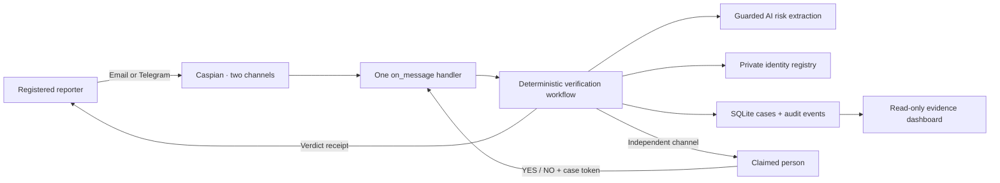

# SecondSignal

**Verify urgent requests through a channel the attacker does not control.**

SecondSignal is a cross-channel verification agent built for the Caspian Buildathon. It receives a suspicious request on email or Telegram, extracts risk facts, contacts the claimed sender through a separately registered channel, and returns a deterministic human-confirmed verdict with a read-only evidence receipt.

## Live demo

Open the public, read-only dashboard at **[secondsignal.vercel.app](https://secondsignal.vercel.app)**. It uses clearly labeled synthetic cases and never loads Caspian credentials, private identity mappings, or real messages. The credential-dependent Caspian email and Telegram listener runs separately as described below.

## The same-channel trust problem

When an email account says “send gift cards now,” replying to that email does not establish who is behind it. The account carrying the request may already be compromised. SecondSignal treats the origin channel as evidence of a claim, never as proof of identity.

Its operating principle is simple:

> The channel carrying a request should not verify itself.

## 60-second product flow

1. A registered reporter receives a suspicious Telegram request.
2. The reporter forwards it to SecondSignal with `/verify Asha Rao`.
3. SecondSignal safely extracts risk facts and creates a time-limited case.
4. Caspian initiates an email to Asha's registered address.
5. Asha replies `NO SS-7K4P2M` from that registered email route.
6. SecondSignal sends `DENIED — DO NOT PROCEED` back to the original Telegram conversation.
7. The dashboard shows an immutable audit timeline and makes the decision boundary explicit: AI analyzed risk; a human response determined the verdict.

## Why Caspian is essential

SecondSignal is not a chatbot duplicated across two integrations. One Caspian `on_message` handler receives both email and Telegram events, normalizes them into one domain message, and dispatches the workflow's output through the correct channel capability.

- Email verification uses `client.initiate(...)` because Caspian can start an email conversation.
- Telegram verification uses `client.send_message(...)` with a previously captured conversation because Telegram bots cannot cold-start a user chat.
- Replies to the current inbound message use `client.reply(...)`.
- The application registers exactly one handler for both channels and listens with queue concurrency.

Without Caspian's common message model and channel-aware delivery methods, the cross-channel guarantee would collapse into separate bots with duplicated policy logic.

## Architecture diagram



See [docs/architecture.md](docs/architecture.md) for the full flow and state model.

## Safety guarantees

- The origin channel is never selected as the verification channel.
- Only configured reporters may open, inspect, or cancel their own cases through messages.
- A verification response is accepted only when its channel, normalized sender address, token, and pending state all match the stored case.
- AI output can describe risk but cannot select identities, routes, state transitions, or verdicts.
- Model failure falls back to deterministic rules and is recorded as an audit event.
- Duplicate reports are idempotent; terminal cases cannot be changed by replayed responses.
- Cases expire to `UNVERIFIED`, never to approval.
- Sensitive strings are redacted before model analysis, persistence, receipts, and logs.
- The web dashboard exposes read-only GET routes and omits reporter and verifier addresses.

These controls reduce same-channel impersonation risk; they do not prove legal identity or protect a user when both registered accounts are compromised. See [docs/threat-model.md](docs/threat-model.md).

## Prerequisites

- Python 3.12
- A Caspian API key
- A Telegram bot token from BotFather
- Access to the email inbox created through Caspian
- Optional: a Featherless API key for structured model-based risk extraction

The deterministic rule analyzer works without Featherless, including the complete offline smoke check.

## Local installation

```powershell
python -m venv .venv
.\.venv\Scripts\python.exe -m pip install -e ".[dev]"
Copy-Item .env.example .env
```

Fill in `CASPIAN_API_KEY` and `TELEGRAM_BOT_TOKEN` in `.env`. Add `FEATHERLESS_API_KEY` if you want live model extraction. Never commit `.env`, `data/identities.json`, captured channel identifiers, or API keys.

## Caspian email and Telegram connection setup

Set these values in `.env`:

```dotenv
CASPIAN_API_KEY=<local-secret>
CASPIAN_BASE_URL=https://api.trycaspianai.com
CASPIAN_EMAIL_USERNAME=secondsignal
TELEGRAM_BOT_TOKEN=<local-secret>
```

When the listener starts, it calls `connect_email(username=...)` and `connect_telegram(bot_token=...)`, records each channel's readiness, registers one message handler, and begins queue-based listening.

The resulting Caspian email address is the reporter-facing or verifier-facing email used in the live demonstration. Send the Telegram bot at least one message before attempting an email-to-Telegram verification route.

## Capturing the Telegram verifier route

Run the temporary route-capture utility, send one message to the Telegram bot from the verifier account, copy the printed identifiers into local environment values, and stop with Ctrl+C:

```powershell
.\.venv\Scripts\python.exe scripts\capture_telegram_route.py
```

The printed `sender_address` and `conversation_id` are private configuration. A Telegram handle by itself is not enough to send an unsolicited bot message.

## Creating `data/identities.json`

Set the registered reporter and verifier routes in the current PowerShell session:

```powershell
$env:DEMO_REPORTER_TELEGRAM_ADDRESS="<captured-reporter-address>"
$env:DEMO_REPORTER_EMAIL="<reporter-email>"
$env:DEMO_VERIFIER_EMAIL="<verifier-email>"
$env:DEMO_VERIFIER_TELEGRAM_ADDRESS="<captured-verifier-address>"
$env:DEMO_VERIFIER_TELEGRAM_CONVERSATION="<captured-verifier-conversation>"
.\.venv\Scripts\python.exe scripts\seed_demo_registry.py
```

The generator validates every required value and refuses to replace an existing registry unless `--force` is supplied.

## Running the listener and dashboard

Initialize the database once:

```powershell
.\.venv\Scripts\python.exe -m secondsignal init-db
```

Start the Caspian listener in one terminal:

```powershell
.\.venv\Scripts\python.exe -m secondsignal listen
```

Start the read-only dashboard in another terminal:

```powershell
.\.venv\Scripts\python.exe -m secondsignal web
```

Open `http://127.0.0.1:8000`. Health probes are available at `/health/live` and `/health/ready`.

Message commands:

```text
/verify <claimed identity>
<suspicious request>

YES <case token>
NO <case token>
/status <case token>
/cancel <case token>
```

## Running tests and smoke check

```powershell
.\.venv\Scripts\python.exe -m pytest
.\.venv\Scripts\python.exe scripts\smoke_check.py
.\.venv\Scripts\python.exe -m ruff check src tests scripts
```

The smoke check uses an in-memory database and no network. It exercises Telegram-to-email denial, email-to-Telegram denial, and an expiring family-emergency request.

## Demonstration scenarios

1. **Executive gift-card denial:** Telegram request → independent email challenge → `NO` → Telegram `DENIED` receipt.
2. **Vendor bank-change denial:** Email request → existing Telegram verifier conversation → `NO` → email-origin conversation receipt.
3. **Family-emergency timeout:** Telegram request → no human answer before the deadline → `UNVERIFIED` receipt.

The recommended recording order is in [docs/demo-script.md](docs/demo-script.md).

## Limitations

- SecondSignal verifies control of a registered route, not a person's legal identity.
- If an attacker controls both the origin and verification accounts, the independent-channel assumption fails.
- Telegram bots require a prior conversation and cannot initiate a new user chat.
- The agent does not block payments or execute financial transactions.
- SQLite and a local JSON registry are appropriate for this demonstration, not a multi-tenant deployment.
- Delivery outages resolve safely as `DELIVERY_FAILED` or `EXPIRED`, but they can prevent a timely decision.
- The rule fallback is intentionally conservative and is not a general fraud-classification model.

## Repository structure

```text
src/secondsignal/       application, workflow, Caspian gateway, and web UI
scripts/                registry setup, Telegram route capture, smoke check
config/                 safe example identity registry
tests/                  unit and integration coverage
docs/                   architecture, threat model, and demo script
submission/             Devpost copy and final submission checklist
data/                   local database and private registry (ignored)
```

## License

SecondSignal is available under the [MIT License](LICENSE).
