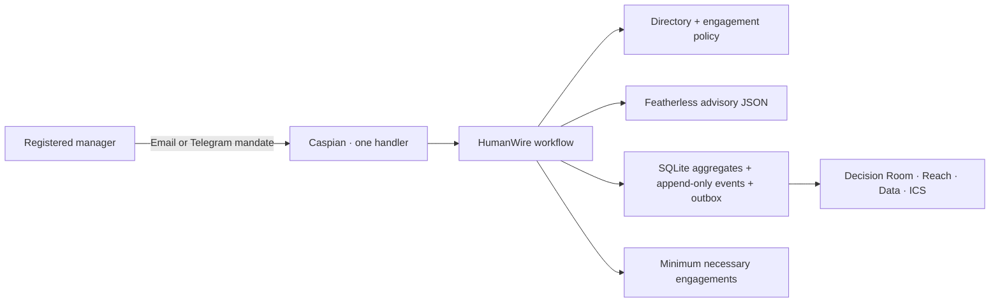

# HumanWire

**The AI chief of staff that selects the minimum necessary engagement for every person a decision touches.**

HumanWire turns one authenticated manager mandate into a bounded, cross-channel coordination plan. It informs people who only need context, asks for acknowledgement where receipt matters, collects quick or structured input where evidence is required, routes explicit approval to the right authority, and prepares a meeting only when asynchronous coordination cannot resolve a verified conflict.

## Live demo

The public deployment target is [secondsignal.vercel.app](https://secondsignal.vercel.app). The app is a deterministic, read-only HumanWire fixture: it loads no local organization directory, provider credentials, model credentials, or private responses. Local and browser gates must pass before that continuity URL is updated.

## The coordination problem

Most coordination software treats reach as a broadcast problem. Real decisions need different contributions from different people, and asking everyone for the same response creates delay without adding authority or evidence.

HumanWire applies one of six explicit contracts:

- `INFORM` delivers context and never manufactures a response.
- `ACKNOWLEDGE` records authenticated receipt without creating interview evidence.
- `QUICK_RESPONSE` asks one focused question.
- `STRUCTURED_INTERVIEW` conducts a bounded multi-question session.
- `REVIEW_APPROVAL` accepts only an explicit authority response.
- `AVAILABILITY` collects exact offset-aware windows for required attendees.

Only quick and structured contributions create interview sessions. HumanWire does not interview everyone.

## 75–90 second product flow

1. A registered manager sends `/mandate` over email or Telegram.
2. HumanWire resolves a safe plan, then shows the manager a destination-free preview of people, direction, reason, engagement type, and required contribution.
3. The manager can use `ENGAGE` for a permitted optional override or `GO` for explicit release; otherwise the configured preview deadline releases the plan.
4. One Caspian handler coordinates all six engagement types across email and Telegram. Silence, provider failure, and alternate-channel continuation remain distinct persisted states.
5. Quick and structured answers persist as asserted evidence. The exact participant confirms answer-derived evidence with `CONFIRM <token>` from the session's current registered route and conversation.
6. `DECIDE <token> APPROVE`, `REJECT`, or `CHANGE <reason>` records an explicit authority response. A required `CHANGE` remains a truthful blocker and is never forced into a meeting.
7. When all required contributions are ready, deterministic policy evaluates alignment. At most two proposal rounds run; an unresolved conflict then moves to scheduling.
8. Required attendees submit `AVAILABLE` windows. A meeting package and downloadable ICS are produced only from a verified overlap; the application never writes to a calendar.
9. Decision Room, Reach, Data, JSON, CSV, and ICS rebuild a safe read-only view from persisted truth.

## Why Caspian and Featherless are essential

Caspian provides one channel-neutral message boundary for email and Telegram. HumanWire registers exactly one `on_message` handler, normalizes provider messages once, replies to the current message when appropriate, initiates new email conversations, and continues only existing Telegram conversations. The same deterministic workflow owns sender, route, token, mandate, assignment, conversation, replay, delivery callback, and failover checks.

Featherless provides constrained JSON suggestions for planning, evidence extraction, alignment analysis, and proposal drafting. Model output is advisory: local schemas, the organization directory, engagement policy, state machines, and transaction fences decide what may persist. If the model is absent or fails, bounded deterministic fallbacks preserve the authority and privacy boundary.

## Architecture and safety invariants



- Model output cannot authenticate a sender, weaken a required contribution, approve a decision, choose a transport destination, or create a meeting.
- Every inbound action correlates to the exact registered person, route, conversation, token, aggregate, and active state.
- Preview release, overrides, answers, confirmations, decisions, proposals, availability, cancellation, expiry, and synthesis use persisted replay/concurrency fences.
- Provider delivery is at least once. Stable outbox identity and leases make callbacks and recovery safe, but an external recipient may still see a duplicate after a provider accepted a send and its callback was lost.
- Required silence, failure, rejection, `CHANGE`, missing evidence, and pending confirmation never become alignment.
- Public projections exclude raw private evidence, change rationale, contact routes, provider bodies, message identifiers, credentials, and operational UUIDs.
- The web app is GET-only; unknown resources use a bodyless 404 and internal APIs require a separate read token outside demo mode.

See [architecture](docs/architecture.md) and the [threat model](docs/threat-model.md) for the complete boundary.

## Local setup and organization seed

Requirements: Python 3.12, a Caspian API key, a Telegram bot token, an email connection created through Caspian, and optionally a Featherless API key.

```powershell
python -m venv .venv
.\.venv\Scripts\python.exe -m pip install -e ".[dev]"
Copy-Item .env.example .env
```

Fill secret values only in `.env`. Keep `ANALYTICS_READ_TOKEN` separate from provider and model credentials. Never commit `.env`, `.env.local`, `.vercel`, `data/organization.json`, database files, contact destinations, conversation identifiers, keys, tokens, private answers, or screenshots containing them.

The safe directory shape is in `config/demo-organization.example.json`. For the seed utility, provide `_EMAIL`, `_TELEGRAM_ADDRESS`, and `_TELEGRAM_CONVERSATION` values for these private prefixes:

```text
HUMANWIRE_CEO
HUMANWIRE_COO
HUMANWIRE_VP_SUPPORT
HUMANWIRE_SUPPORT_MANAGER
HUMANWIRE_US_TEAM_LEAD
HUMANWIRE_APAC_TEAM_LEAD
HUMANWIRE_VP_PEOPLE
```

Then create the ignored local directory:

```powershell
.\.venv\Scripts\python.exe scripts\seed_humanwire_organization.py
```

The utility refuses to overwrite an existing directory unless `--force` is explicit.

## Listener and web commands

```powershell
.\.venv\Scripts\python.exe -m humanwire init-db
.\.venv\Scripts\python.exe -m humanwire listen
```

In another terminal:

```powershell
.\.venv\Scripts\python.exe -m humanwire web
```

Open `http://127.0.0.1:8000`. Health probes are `/health/live` and `/health/ready`.

Core message forms:

```text
/mandate
<objective and constraints>

GO <token>
ENGAGE <token> <person_id> <engagement_type>
ACK <token>
CONFIRM <token>
DECIDE <token> APPROVE
DECIDE <token> REJECT
DECIDE <token> CHANGE <reason>
ACCEPT <token>
REJECT <token>
CHANGE <token> <requested change>
AVAILABLE <token> <start>/<end>
/status <token>
/cancel <token>
```

## Tests, offline smoke, and live checklist

```powershell
.\.venv\Scripts\python.exe -m pytest -q
.\.venv\Scripts\python.exe -m ruff check src tests scripts
.\.venv\Scripts\python.exe scripts\smoke_humanwire.py
.\.venv\Scripts\python.exe -m humanwire smoke
```

The smoke proof uses a temporary file-backed database, real domain/workflow/repository/web boundaries, and deterministic fake channel/model adapters. It makes no network call and prints exactly eleven safe `PASS` lines.

The opt-in live mode only prints a manual checklist and has no provider, model, or database side effects:

```powershell
.\.venv\Scripts\python.exe -m humanwire smoke --live --confirm-live
```

Actual Caspian and Telegram proof is a separate operator gate. It must cover one inform, acknowledgement, quick response, email structured interview continued on Telegram, authenticated evidence confirmation, explicit approval response, delivery failover, and three consecutive complete flows without database edits.

## Private PostgreSQL sandbox readiness

The private sandbox is a separate operator-owned deployment, PostgreSQL database, Caspian project, directory, analytics token, email connection, Telegram bot, and set of consenting test identities. Do not reuse the public demo project, its synthetic directory, or its SQLite database.

Copy `.env.example` to an ignored private environment and set these required variables there:

```text
CASPIAN_API_KEY
TELEGRAM_BOT_TOKEN
CASPIAN_EMAIL_USERNAME
DATABASE_URL
ORGANIZATION_PATH
ENGAGEMENT_REQUIRE_GO
PUBLIC_DEMO
HUMANWIRE_ALEMBIC_REVISION
```

`DATABASE_URL` must use `postgresql://` or `postgresql+psycopg://`, `ORGANIZATION_PATH` must identify a distinct private directory containing both email and Telegram routes, `ENGAGEMENT_REQUIRE_GO` must be `true`, and `PUBLIC_DEMO` must be `false`. `FEATHERLESS_API_KEY` is optional; deterministic fallbacks remain authoritative when it is absent.

Schema creation is migration-only for this sandbox. The operator must run Alembic against the intended private target, verify the current revision through authorized database operations, and only then set `HUMANWIRE_ALEMBIC_REVISION` to the exact repository head:

```powershell
.\.venv\Scripts\python.exe -m alembic upgrade head
.\.venv\Scripts\python.exe -m humanwire sandbox check
.\.venv\Scripts\python.exe -m humanwire sandbox checklist
```

Do not use `humanwire init-db` for private sandbox startup. `sandbox check` is a static, read-only preflight: it does not load `.env`, connect to PostgreSQL or providers, query the installed revision, run migrations, call a model, or write repository state. It prints only `PASS`, `FAIL`, or `PENDING` with safe requirement variable names and aggregate directory/migration counts. A matching `HUMANWIRE_ALEMBIC_REVISION` is an operator attestation, not connectivity proof; absent attestation is `PENDING`, and a stale value is `FAIL`.

`sandbox checklist` remains `PENDING` until one listener owns the provider stream/database and three complete flows use only consenting operator-owned identities. The flows must cover `INFORM`, authenticated acknowledgement, `QUICK_RESPONSE` plus exact confirmation, an email structured interview continued on Telegram plus confirmation, explicit approval, alternate-channel progression, bounded proposal/scheduling, and matching read-only projections. Retain only safe token aliases, timestamps, aggregate counts, trace hashes, redacted screenshots, and outcomes. Never retain credentials, URLs, hosts, usernames, passwords, routes, identities, destinations, provider bodies, or private answers. Set `live_provider_verified=true` only after all three flows and the retention/evidence review pass.

## Reproducible synthetic persona proof

Run generation and frozen replay through the installed module with explicit single-owner run-root paths that do not yet exist. HumanWire atomically creates each root, so concurrent cooperative harness runs have exactly one owner. The generated transcript must stay inside its claimed run root:

```powershell
$generateRoot = Join-Path $PWD "work/synthetic-generate-01"
python -m humanwire synthetic generate --output (Join-Path $generateRoot "transcript.json") --run-root $generateRoot

$replayRoot = Join-Path $PWD "work/synthetic-replay-01"
python -m humanwire synthetic replay --transcript tests/fixtures/humanwire/synthetic_launch_v1.json --run-root $replayRoot
```

The installed `humanwire synthetic ...` command and `python scripts/synthetic_humanwire.py ...` wrapper accept the same arguments. A run fails closed if its root already exists, a generation output escapes that root, a competing file appears at the final output, or a frozen transcript fails strict validation or digest verification. It never overwrites or recursively deletes preexisting data, and it writes no artifact outside the claimed root.

Atomic ownership protects competing well-behaved proof harness runs. It is not a security boundary against a malicious process running under the same operating-system account with direct filesystem control.

The default proof runs two linked, deterministic stories. Its primary mandate covers all six engagement contracts, two independent quick-response personas, an email structured interview that advances through a saved alternate-channel step to Telegram confirmation, explicit approval, availability, two bounded proposal rounds, verified overlap, and a meeting-ready package. A separate required approval returns `CHANGE` and ends `PARTIAL` with no proposal or meeting.

Successful stdout contains only the six exact provenance labels, safe scenario/run identifiers, action/inbound/delivery counts, `terminal_state=partial`, `terminal_states=meeting_ready,partial`, and semantic trace SHA-256. It contains no routes, destinations, response content, operational UUIDs, or filesystem paths. The transcript excludes private fixture text, and `CapturedDelivery` objects are never serialized.

**Non-live disclaimer:** This deterministic synthetic proof uses simulated personas, injected fake-Caspian transport, deterministic local policy, and fresh local SQLite. It does not contact real people, call Caspian or Featherless, verify a live provider or model, or constitute real-human testing.

### Watch the local synthetic agent runtime

Every watch uses an explicit run root that must not exist. The deterministic viewer is reproducible offline simulation/replay proof; the Featherless mode is private exploratory model-assisted behavior and is not live-provider or human proof. Both remain local-only at `http://127.0.0.1:8766`. The public Vercel demo cannot start a simulation.

```powershell
# Deterministic, no external model/provider call
.\.venv\Scripts\python.exe -m humanwire synthetic watch `
  --agent-mode deterministic `
  --seed 8842 `
  --run-root work\synthetic-watch-8842 `
  --output work\synthetic-watch-8842\transcript.json

# Explicit private exploratory Featherless mode; reads only configured Featherless settings
.\.venv\Scripts\python.exe -m humanwire synthetic watch `
  --agent-mode featherless `
  --seed 8842 `
  --run-root work\synthetic-model-8842 `
  --output work\synthetic-model-8842\transcript.json
```

Wait for completion before downloading JSON or CSV evidence. Stop the viewer only after downloads; stopping it does not mutate persisted workflow state. Validate privacy and replay into another fresh root before treating any output as frozen. Model-assisted output must never replace the committed deterministic fixture. See the [synthetic agent runtime operator guide](docs/synthetic-agent-runtime.md) for the freeze, replay, download, privacy, and claim rules.

## Analytics and Power BI contract

The Data page, JSON endpoint, and CSV endpoint share one canonical redacted 16-field projection. Non-demo `/api/v1/*` requests require `Authorization: Bearer <read-only-token>`; credentials never belong in query strings, shared URLs, screenshots, or committed Power BI source text.

Power BI can use an authenticated Web request where managed header credentials are available, or a downloaded CSV for an offline snapshot. It must never connect directly to `humanwire.db`. Field order, filters, privacy exclusions, and refresh limitations are documented in [HumanWire analytics](docs/analytics.md).

## Limitations and calendar boundary

- SQLite is the local proof boundary, not a multi-tenant production database.
- The organization directory is administrator-managed local configuration; HumanWire does not provide route enrollment or user account administration.
- Provider delivery is at least once, not exactly once.
- Telegram outreach requires a previously established bot conversation.
- Featherless improves suggestions but never owns authority; deterministic fallback is intentionally conservative.
- The public demo is synthetic and read-only. Offline fake-provider proof is not evidence of a live provider run.
- The ICS artifact uses `METHOD:PUBLISH`. HumanWire does not create, update, cancel, or verify an external calendar event.
- HumanWire does not claim organizer endorsement, Power BI certification, production security certification, or realtime analytics.

The recommended product walkthrough is in [docs/demo-script.md](docs/demo-script.md).

## Repository structure

```text
src/humanwire/       domain, workflow, provider gateway, persistence, and web app
tests/humanwire/     unit, race, integration, cutover, and privacy coverage
scripts/             organization seed, offline smoke, and synthetic proof wrappers
config/              safe organization-directory example
docs/                architecture, threat model, demo, and analytics contract
submission/          differentiated Devpost narratives and release checklist
```

## License

HumanWire is available under the [MIT License](LICENSE).
