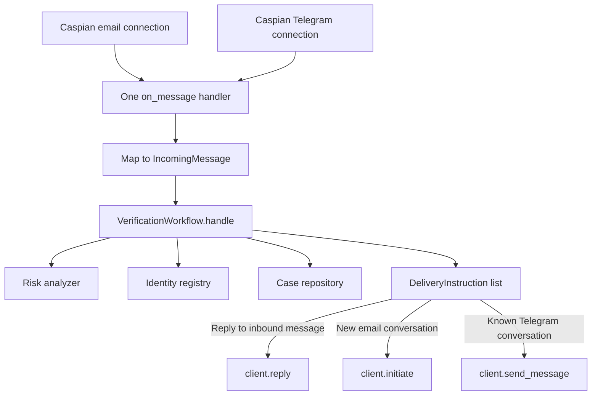
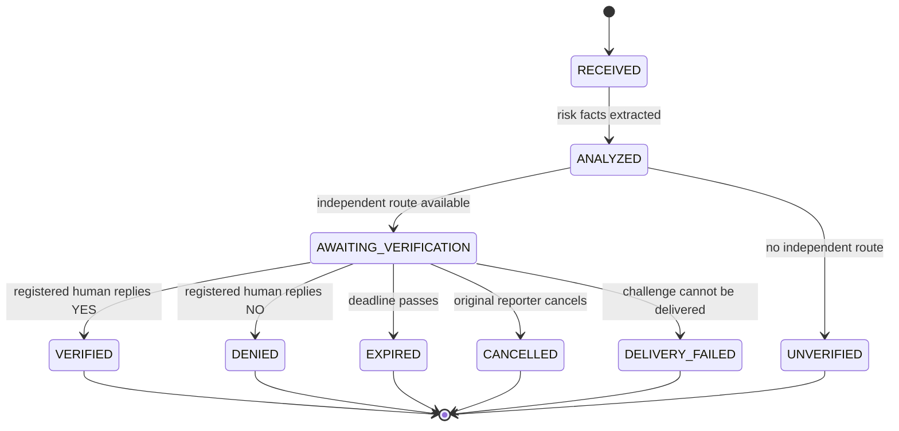

# SecondSignal architecture

SecondSignal separates communication, risk extraction, identity policy, state transitions, and evidence presentation. The core workflow knows nothing about Caspian SDK objects; the Caspian gateway knows nothing about verification policy.

## Single-handler channel flow

`CaspianGateway.connect()` creates both channel connections and registers `_handle_message` exactly once. Every incoming email or Telegram message follows the same path through the same handler. The gateway converts Caspian's normalized sender metadata to the channel-neutral `IncomingMessage` model and dispatches the workflow's declarative output.

## Initiate versus send

The two verification directions use different Caspian capabilities:

| Origin | Independent route | Delivery operation | Reason |
|---|---|---|---|
| Telegram | Email | `client.initiate(email_connection_id, recipient, text)` | Email supports starting a new conversation. |
| Email | Telegram | `client.send_message(conversation_id, text)` | Telegram bots need an existing conversation initiated by the user. |
| Either | Current inbound message | `client.reply(message_id, text)` | Acknowledgements and command errors belong to the active conversation. |

The identity registry stores the real Telegram sender address and conversation ID captured from an inbound message. A display handle is never treated as a deliverable route.

## Domain boundaries

- **Gateway:** connects channels, maps messages, executes delivery instructions, and reports verification delivery failures.
- **Workflow:** authorizes reporters, resolves claimed identities, selects an independent route, creates cases, validates responses, and produces receipts.
- **Risk analyzer:** extracts facts and a redacted summary. It has no route-selection or verdict authority.
- **Identity registry:** contains authorized reporters, aliases, and separately registered routes. The real file is private local configuration.
- **State machine:** defines the only legal case transitions and prevents terminal-state mutation.
- **Repository:** persists cases, append-only audit events, idempotency keys, and runtime readiness.
- **Dashboard:** reads sanitized case views and events. It has no dependency on the workflow or gateway and exposes no mutating route.

## Case states

Every terminal state is immutable. A duplicate response receives the existing verdict and cannot alter it. An expired or failed verification never defaults to approval.

## Decision path

1. Parse a narrow command grammar.
2. Verify that the reporter's normalized address is authorized for the origin channel.
3. Resolve the claimed identity from local aliases.
4. Redact secrets and extract risk facts using Featherless or deterministic fallback rules.
5. Select a deliverable route whose channel differs from the origin.
6. Persist the case and audit events before sending the verification challenge.
7. Accept `YES` or `NO` only from the stored channel and sender address with the exact case token.
8. Use the state machine to persist the verdict.
9. Send an evidence receipt to the original conversation.

## Read-only dashboard boundary

The dashboard receives only the repository and settings. It does not receive the workflow, state machine, identity registry, or Caspian client. Its routes are limited to:

- `GET /`
- `GET /cases/{token}`
- `GET /health/live`
- `GET /health/ready`

Case views are explicitly sanitized before rendering. Reporter addresses, verifier sender addresses, verifier recipients, original unredacted text, and credentials are never placed in the template context. POST, PUT, PATCH, and DELETE requests return method-not-allowed responses.

## Runtime health

The gateway writes `channel.email` and `channel.telegram` readiness values. The expiry worker writes `listener.heartbeat` before checking due cases. Readiness succeeds only when both channels are ready and the heartbeat is newer than `max(EXPIRY_POLL_SECONDS × 3, 20 seconds)`.
