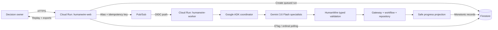

# HumanWire — All Things Agentic Technical Specification

## 1. Status And Intent

- **Status:** Approved for implementation planning
- **Date:** 2026-08-16
- **Hackathon:** All Things Agentic Hackathon
- **Primary category:** Taskmaster
- **Source:** [`prd.md`](./prd.md)
- **Implementation principle:** extend HumanWire through adapters; preserve its existing authority, privacy, replay, Standard-agent, and Vercel contracts

This specification turns the approved PRD into a Google-native build. A judge must be able to open a Cloud Run URL, start one launch-decision workflow, watch Gemini-powered specialists perform real bounded work, refresh without losing progress, replay the exact saved chronology, and download a safe meeting-ready result.

## 2. Technical Success Criteria

The build succeeds only when:

1. Gemini performs bounded specialist reasoning through Google ADK.
2. Cloud Run serves the product and executes a private worker.
3. Pub/Sub separates request creation from long-running work.
4. Firestore preserves monotonic public state across refresh and instance replacement.
5. HumanWire alone controls identity, evidence, approval, availability, and meeting readiness.
6. Graph, conversation, data, lifecycle, exports, and outcome come from one immutable chronology.
7. Existing Standard and optional PydanticAI/Featherless paths remain compatible unless the Google mode is selected.

This implements PRD Epics 2, 3, 5, 6, and 8 while preserving Epics 1, 4, and 7.

## 3. System Architecture



### 3.1 Existing HumanWire core

Retain the current request catalog, `StudioRunManager`, gateway, workflow, repository, evidence/approval/scheduling services, transcript binding, `StudioProgressObserver`, `StudioProgressStore`, exports, composer, decision graph, replay, and hardened FastAPI boundary.

Gemini or ADK must never write directly to the authoritative repository or Firestore. They produce typed candidate decisions; HumanWire validates and applies them.

### 3.2 One image, two Cloud Run services

Deploy one immutable container image twice:

- `humanwire-web`: public product routes only.
- `humanwire-worker`: private Pub/Sub handler only.

`HUMANWIRE_SERVICE_ROLE=web|worker` selects the entry point. One image avoids drift; separate service identities preserve least privilege. This supports PRD Epics 2, 5, and 8.

### 3.3 Explicit runtime modes

Do not repurpose existing modes:

- `standard`: current deterministic behavior; unchanged.
- `model_assisted`: current configured PydanticAI/Featherless adapter; unchanged.
- `google_adk`: Gemini through Google ADK; submission runtime.

The Cloud app forces `google_adk`. The existing Vercel product remains Standard-only and truthfully labeled. This supports PRD Epics 1 and 8.

## 4. Runtime Components

### 4.1 Public web service

**Responsibility:** validate requests, create queued runs, publish work, serve workspace/polling/exports, and reveal no private execution data.

Create `create_google_submission_app()` as a separate FastAPI factory using the current template/static system and hardened middleware.

Requirements:

- Preserve exact Host, Origin, method, raw-path, query, content-length/type, body-size, fixed-error, and security-header behavior.
- Create the Firestore run before publishing Pub/Sub work.
- Return a workspace URL immediately after enqueue.
- Never run coordination inside the public request process.
- Never render, log, or retain model credentials/provider bodies.

**PRD:** Epics 1, 2, 5, 7, 8.

### 4.2 Private worker service

**Responsibility:** claim a queued run, construct ADK/Gemini, execute HumanWire, persist safe progress, bind completion, and release ownership.

Requirements:

- IAM allows only the configured Pub/Sub push identity to invoke it.
- Validate envelope, base64 payload, schema version, alias, and idempotency key.
- Claim in Firestore before constructing any model client.
- Treat duplicate running/terminal delivery idempotently.
- Retry transient infrastructure errors; publish fixed failed state for terminal domain/model failure.
- Publish terminal state only after final bindings and worker cleanup.

**PRD:** Epics 3, 5, 6, 8.

### 4.3 Google ADK coordinator

The coordinator receives only a bounded safe assignment context: contract, persona role, objective excerpt, public prior decisions, and allowed intents. It selects a specialist and returns one structured candidate decision. It does not own lifecycle or workflow state.

Use Google ADK 2.x `Agent` plus a runner/app wrapper. Default model: `gemini-3.6-flash`, satisfying the event's Gemini 3.5+ requirement. Configuration may select another allowlisted qualifying model but cannot silently downgrade.

**PRD:** Epics 2, 3, 8.

### 4.4 Specialist agents

- **Planning:** bounded coordination recommendation; no invented identity or permission.
- **Outreach:** role-appropriate acknowledgement and targeted questions.
- **Evidence:** classify assertion/answer/confirmation candidate; cannot itself confirm evidence.
- **Conflict:** explain disagreement and request minimum interviews; cannot approve its own change.
- **Proposal:** synthesize confirmed evidence into proposal/revision.
- **Authority:** interpret responses within the assigned approval contract.
- **Scheduling:** interpret availability only when the workflow requests it.

All specialists emit the same strict decision-schema family. They have no repository, Firestore, email, calendar, or messaging mutation tool.

**PRD:** Epics 3 and 8.

### 4.5 Gemini decision-engine factory

Create a frozen, serializable factory containing only model ID, Google project/location, deadline/retry limits, and a safe runtime label. Build SDK and ADK clients inside the execution process; never pickle clients, locks, access tokens, or service-account documents.

This preserves HumanWire's hard-timeout isolation: a non-cooperating model process can be terminated and reaped. Local development may explicitly use `GEMINI_API_KEY`; cloud uses Vertex AI Application Default Credentials through service identity. Credentials never enter browser payloads, prompts, Firestore, errors, exports, or logs.

**PRD:** Epics 3, 5, 8.

### 4.6 HumanWire authority layer

Existing components remain authoritative for:

- Identity and assignment contracts.
- Gateway delivery and handler count.
- Evidence assertion/confirmation.
- Conflict/interview transitions.
- Proposal creation/revision/response meaning.
- Approval.
- Availability and overlap.
- Meeting readiness.
- Transcript and semantic binding.

The Google adapter converts ADK output into the current `PersonaDecision`; accepted decisions traverse the gateway exactly once. Malformed, late, mismatched, unsafe, or unauthorized results become inert rejected/no-response/error events.

**PRD:** Epics 3 and 6.

### 4.7 Durable progress publisher

Add an optional publisher interface beside the in-memory `StudioProgressStore`. `StudioProgressObserver` remains the canonical public projection owner.

Guarantees:

- Exact monotonic product ordinals and append order.
- No rewriting prior records.
- Same ordinal/hash is idempotent; divergent duplicate fails closed.
- Complete and failed snapshots are terminal and exact-idempotent.
- Final export binding is atomic with terminal metadata.
- `publisher=None` remains byte-compatible.

**PRD:** Epics 4, 5, 6.

### 4.8 Firestore run repository

Expose Firestore behind a protocol so unit tests use an in-memory implementation and integration tests use the emulator. It owns creation, active ownership, worker claims/leases, timeline append, terminal binding, reconstruction, exports, and retry eligibility. It stores no raw provider request/response, credential, contact route, or private persona fact.

**PRD:** Epics 5, 6, 8.

### 4.9 Pub/Sub dispatcher

Provide:

- `InlineRunDispatcher` for explicit local/test use.
- `PubSubRunDispatcher` for Cloud.

Cloud messages contain only:

```json
{
  "schema_version": 1,
  "run_alias": "coordination-<safe token>",
  "idempotency_key": "<safe opaque token>"
}
```

The normalized request lives in Firestore. Publication failure must not leave a workspace falsely claiming execution started.

**PRD:** Epics 1, 2, 5.

### 4.10 Browser controller

Add a cloud polling adapter while preserving existing stream/local polling modes:

- Poll immediately after hydration.
- Send `If-None-Match` after the first snapshot.
- On `304`, keep graph and manual selection unchanged.
- On changes, render the authoritative prefix; retain history unless Follow Live is active.
- Cancel stale queues on Pause, Follow Live, manual replay, terminal hydration, New coordination, and visibility change.
- Synchronize graph, conversation, data, lifecycle, and explanation to one selected ordinal.
- Enable downloads only after terminal binding.

**PRD:** Epics 2, 4, 5, 6, 7.

### 4.11 Exports

Generate JSON/CSV from the immutable public timeline after terminal binding. Never accept export content from the browser and never depend on the initiating web instance.

Requirements: row-for-row parity; unique `timeline_ordinal`; optional `persisted_ordinal`; explicit `effect`; safe provenance; CSV formula/control neutralization; no credentials, provider bodies, private facts, emails, internal keys, commands, paths, or operational UUIDs; `409` before binding; terminal digests for proof.

**PRD:** Epic 6.

### 4.12 Observability and proof

Cloud Logging receives allowlisted structured fields only: safe run hash, service/revision, event type, state, ordinal, latency bucket, model ID, and fixed error code. Never log exception/provider bodies.

Submission evidence includes Cloud Run revisions, Pub/Sub configuration, safe Firestore structure, a run digest matching the product, and an architecture diagram matching observed behavior.

**PRD:** Epic 8.

## 5. Firestore Data Model

### 5.1 Active ownership

Path: `humanwire_control/active_run`

Fields: `run_alias`, `state`, `owner_version`, `updated_at`. Creation is transactional. A concurrent request gets fixed `active_run` without the owner's alias.

### 5.2 Run metadata

Path: `humanwire_runs/{run_alias}`

Fields:

- `schema_version`, `run_alias`, `idempotency_key_hash`
- normalized public `request`
- `agent_mode=google_adk`, `model_id=gemini-3.6-flash`
- `state`, `lifecycle_stage`, `saved_ordinal`, `timeline_count`
- `claim_owner`, `lease_expires_at`, `version`
- fixed `outcome`
- `semantic_digest`, `json_digest`, `csv_digest`
- server timestamps for creation/start/update/completion

### 5.3 Immutable timeline

Path: `humanwire_runs/{run_alias}/timeline/{ordinal}` where IDs are padded (`00000031`).

Fields: schema version, timeline ordinal, record hash, safe event, optional synchronized conversation/data/transition, and server timestamp.

The append transaction requires `ordinal == timeline_count + 1`. Same hash is idempotent; different content at that ordinal fails closed. One record per document avoids coupling refresh/export behavior to one large final document.

### 5.4 Claims and leases

The Pub/Sub handler transaction changes `queued → running`, records a safe claim owner and bounded lease, and increments `version`. Duplicate delivery of a healthy claim or terminal run does not rerun. Expired recovery must be explicit and append a visible safe recovery event without duplicating persisted authority.

### 5.5 Final binding

Terminal metadata is written only after all records are durable, exports reconstruct successfully, transcript/semantic checks pass, digests agree, and no model worker survives. One transaction marks terminal and releases active ownership, so the browser cannot observe `complete` with missing exports.

### 5.6 Retention

A documented environment-controlled retention window may delete old demo runs administratively. Deletion is never a public browser route. The default must preserve judging evidence without retaining data indefinitely.

## 6. API Contracts

### 6.1 Public routes

- `GET /`: composer; creates no run.
- `GET /api/catalog`: fixed safe catalog.
- `POST /api/runs`: validates, creates, dispatches; returns `202` with safe alias/workspace/state.
- `GET /runs/{alias}`: workspace shell; fixed `404` for malformed/unknown alias.
- `GET /api/runs/{alias}`: current public snapshot with `ETag` and `X-HumanWire-Saved-Ordinal`; matching `If-None-Match` returns `304`.
- `GET /api/runs/{alias}/evidence.json`: bound terminal JSON; `409` before ready.
- `GET /api/runs/{alias}/evidence.csv`: bound terminal CSV; `409` before ready.
- `GET /healthz`: fixed service-role readiness only; no Gemini invocation or data enumeration.

`POST /api/runs` success:

```json
{
  "run_alias": "coordination-<safe token>",
  "workspace_url": "/runs/coordination-<safe token>",
  "state": "queued"
}
```

Errors are fixed safe codes: `invalid_request`, `request_too_large`, `origin_forbidden`, `active_run`, `dispatch_unavailable`, or `request_failed`.

### 6.2 Private worker route

`POST /internal/pubsub/runs` accepts only the authenticated Pub/Sub push envelope.

- `204`: accepted, duplicate terminal, or duplicate healthy claim.
- `400`: irreparable fixed envelope error.
- `409`: conflicting healthy claim under the chosen acknowledgement policy.
- `500/503`: retryable infrastructure failure.

No response contains request details, claim token, provider body, stack trace, or secret.

## 7. End-To-End Flow

### 7.1 Create and dispatch

1. Browser submits once.
2. Web validates the exact request boundary.
3. Firestore transaction creates a queued run and active ownership.
4. Web publishes safe alias/idempotency message.
5. Browser navigates and polls.

### 7.2 Claim and execute

1. Pub/Sub invokes private worker with OIDC.
2. Worker validates and transactionally claims.
3. Worker reads normalized request from Firestore.
4. Worker constructs request-scoped scenario and frozen Google factory.
5. ADK coordinator dispatches Gemini specialists.
6. HumanWire validates candidates and sends accepted decisions through one gateway.

### 7.3 Publish and display

1. HumanWire emits authoritative events.
2. Progress observer creates synchronized safe records.
3. Firestore publisher appends the next record transactionally.
4. Metadata advances version/ordinal.
5. Browser sees changed ETag and renders; manual replay remains stable.

### 7.4 Complete or fail

Completion requires evidence → proposal/revision → approval → availability → meeting readiness in order, final transcript/semantic checks, export digests, cleanup, and terminal binding. Failure preserves completed records, labels the current stage Failed rather than Completed, retains no exception graph, and permits only a new isolated retry.

## 8. Security, Privacy, And Authority

### 8.1 IAM

- Web identity: Firestore run access and Pub/Sub publish only.
- Worker identity: Firestore, Vertex AI, and logging only.
- Push identity: Cloud Run invoker on worker only.
- Public users: no direct Firestore, Pub/Sub, or worker access.

### 8.2 Credentials

Cloud uses ADC; local AI Studio key is read only under explicitly selected Google mode. Configuration exposes presence/readiness, not values. Safe exceptions are created outside `except` scopes so causes/contexts cannot retain secrets.

### 8.3 Prompt/output safety

Prompts contain minimum safe context. Model output is untrusted and structurally validated before gateway delivery. Unicode-normalized privacy scanning rejects paths, URIs, credentials, commands, provider bodies, and private facts except exact approved product tokens.

### 8.4 Non-delegable authority

Gemini cannot authenticate identity, confirm evidence, reinterpret acknowledgement as approval, approve without contract, store early availability, declare meeting readiness, or mutate Firestore. HumanWire owns each of those transitions.

### 8.5 Public boundary

Inherit canonical Host allowlist, exact same-origin comparison, singular ASCII Origin, exact raw paths/methods, empty query where required, singular bounded Content-Length, exact JSON content type, fixed errors, CSP/no-store/nosniff/referrer/frame protections.

## 9. Configuration

Shared/cloud settings:

```text
HUMANWIRE_SERVICE_ROLE=web|worker
HUMANWIRE_RUNTIME=google_adk
HUMANWIRE_PUBLIC_ORIGINS=https://<deployed-host>
HUMANWIRE_FIRESTORE_DATABASE=(default)
HUMANWIRE_PUBSUB_TOPIC=<topic>
HUMANWIRE_MODEL_ID=gemini-3.6-flash
HUMANWIRE_GOOGLE_LOCATION=<region>
HUMANWIRE_RUN_RETENTION_HOURS=<bounded integer>
GOOGLE_CLOUD_PROJECT=<project-id>
GOOGLE_CLOUD_LOCATION=<region>
GOOGLE_GENAI_USE_VERTEXAI=true
```

Local-only optional: `GEMINI_API_KEY`. `.env.example` lists only the variable name.

## 10. File Plan

### 10.1 New production files

```text
src/humanwire/google_config.py
src/humanwire/google_agents.py
src/humanwire/google_decision_engine.py
src/humanwire/cloud_store.py
src/humanwire/cloud_dispatch.py
src/humanwire/cloud_progress.py
src/humanwire/cloud_web.py
src/humanwire/cloud_worker.py
src/google_web_index.py
src/google_worker_index.py
infra/google/README.md
infra/google/cloudbuild.yaml
infra/google/deploy.ps1
infra/google/deploy.sh
infra/google/firestore.indexes.json
docs/all-things-agentic-architecture.md
submission/all-things-agentic.md
submission/all-things-agentic-checklist.md
Dockerfile
.dockerignore
```

### 10.2 Existing files to modify

- `pyproject.toml`: optional Google dependency group.
- `config.py`: explicit safe Google settings.
- `studio_models.py`: `google_adk` mode and safe runtime proof.
- `studio_run.py`: reusable request-scoped runner without changing local manager ownership.
- `studio_projection.py`: optional publisher hooks; `None` byte-compatible.
- `coordination_studio.html`: truthful Gemini/ADK/Cloud disclosure.
- `coordination-studio.js`: ETag polling and cloud exports.
- `coordination-studio.css`: responsive disclosure without hiding controls.

### 10.3 New tests

```text
tests/humanwire/test_google_config.py
tests/humanwire/test_google_agents.py
tests/humanwire/test_google_decision_engine.py
tests/humanwire/test_cloud_store.py
tests/humanwire/test_cloud_dispatch.py
tests/humanwire/test_cloud_progress.py
tests/humanwire/test_cloud_web.py
tests/humanwire/test_cloud_worker.py
tests/humanwire/test_google_e2e.py
tests/humanwire/test_google_deployment_contract.py
```

Extend the existing hostile frontend harness instead of replacing it.

## 11. Dependencies And Official References

Add an optional group installed by the Cloud image:

```toml
[project.optional-dependencies]
google = [
  "google-adk[gcp]>=2.0.0,<3.0.0",
  "google-cloud-firestore>=2.28,<3.0",
  "google-cloud-pubsub>=2.0,<3.0",
  "google-cloud-logging>=3.0,<4.0",
]
```

Primary references:

- [Google ADK project structure and dependencies](https://google.github.io/agents-cli/guide/project-structure/)
- [Google ADK authentication](https://google.github.io/agents-cli/guide/authentication/)
- [Gemini structured outputs](https://ai.google.dev/gemini-api/docs/structured-output)
- [Cloud Run with Pub/Sub](https://docs.cloud.google.com/run/docs/tutorials/pubsub)
- [Authenticated Pub/Sub push](https://docs.cloud.google.com/pubsub/docs/authenticate-push-subscriptions)
- [Cloud Run service identity](https://docs.cloud.google.com/run/docs/securing/service-identity)
- [Firestore Python client](https://docs.cloud.google.com/python/docs/reference/firestore/latest)
- [Firestore async client](https://docs.cloud.google.com/python/docs/reference/firestore/latest/google.cloud.firestore_v1.async_client)
- [Firestore async transactions](https://docs.cloud.google.com/python/docs/reference/firestore/latest/google.cloud.firestore_v1.async_transaction)

## 12. Testing Strategy

### 12.1 TDD rule

Every slice starts with an intended failing test, then focused green, adjacent regressions, static/privacy gates, and independent review for Critical/Important defects.

### 12.2 Unit and adapter tests

Cover settings/credential non-retention; model allowlist; factory serialization; structured decisions; Pub/Sub hostile envelopes; Firestore claims/leases/appends/duplicates/divergence/terminal transactions; export parity/privacy; fixed exception graphs. Use fake ADK, Firestore, Pub/Sub, and clocks. No paid call or ambient credential in normal tests.

### 12.3 Emulator integration

Using Firestore emulator, prove one winner under concurrent create, duplicate claims do not execute twice, append order is monotonic, divergent duplicate rejects, terminal binding/ownership release are atomic, and refresh exactly reconstructs the prefix.

### 12.4 Deterministic cloud E2E

With fake ADK output, assert strict chronology:

1. Request.
2. Outreach.
3. Conflict.
4. Targeted interview.
5. Confirmed evidence.
6. Proposal.
7. Revision.
8. Approval.
9. Availability.
10. Meeting package.

Assert no early Sofia approval or Daniel availability.

### 12.5 Live Gemini proof

An explicit opt-in run verifies real ADK/Gemini invocation, exactly-one gateway delivery per accepted decision, durable timeline, refresh, final binding, and safe model/project/revision evidence. Missing configuration is reported as pending, never silently replaced by Standard mode.

### 12.6 Browser verification

Verify 1680×950, 1280×720, 600×900, and 390×844: composer, live progression, Pause/Follow/manual replay, refresh, terminal hydration, row visibility, downloads, New coordination, focus, reduced motion, no overflow, ≥44px controls, ≥14px text, graph containment, and clean console.

### 12.7 Compatibility gates

- Frozen Standard transcript bytes and semantic/restart hashes unchanged where asserted.
- Existing Vercel/local studio tests pass.
- Full HumanWire and repository tests pass.
- Ruff, Node syntax, diff check, privacy scans, and smoke commands pass.

## 13. Failure And Recovery

- **Missing Google config:** fixed failed state; no fallback to another runtime.
- **Model timeout/malformed output:** terminate/reap process; one inert safe event; late result cannot win.
- **Firestore transient failure:** bounded retry; no visible ordinal without durable record.
- **Pub/Sub redelivery:** terminal/healthy duplicate is idempotent; expired lease follows explicit recovery.
- **Browser disconnect:** worker continues; reopening reconstructs from Firestore.
- **Worker termination:** lease expiry permits controlled recovery without duplicating prior authority.

## 14. Deployment

### 14.1 Resources

Artifact Registry, Firestore Native database, Pub/Sub topic/authenticated push subscription, public web Cloud Run service, private worker Cloud Run service, three dedicated service accounts, and Cloud Logging.

### 14.2 Order

1. Enable APIs.
2. Create service accounts/IAM.
3. Create Firestore/indexes.
4. Create Pub/Sub topic.
5. Build/push one image.
6. Deploy private worker without public access.
7. Create authenticated push subscription.
8. Deploy public web service.
9. Set exact host/origin config.
10. Run boundary, deterministic, live-model, refresh, export, browser, and privacy acceptance.

### 14.3 Rollback

Repoint both services to a known-good revision; preserve Firestore history; stop delivery before incompatible schema rollback. Existing Vercel deployment remains independent and clearly labeled Standard agents.

## 15. Implementation Sequence

### Phase 1 — contracts and configuration

Dependencies, settings, explicit mode, repository/dispatcher/publisher/engine protocols. Exit: focused and Standard compatibility green.

### Phase 2 — ADK/Gemini adapter

Factory, coordinator, specialists, typed conversion, hard timeout. Exit: fake success/timeout/privacy green plus opt-in live probe.

### Phase 3 — Firestore projection

Ownership, claims, leases, appends, reconstruction, terminal binding, emulator tests. Exit: concurrency/idempotency/restart/export green.

### Phase 4 — Pub/Sub worker

Dispatcher, private envelope, execution/publisher wiring, duplicate/retry/cleanup tests. Exit: duplicate push cannot duplicate work.

### Phase 5 — cloud web and polling

Routes, ETag adapter, replay/refresh/exports/responsive behavior. Exit: create → refresh → complete → download works through fake cloud stack and browser harness.

### Phase 6 — deploy and prove

IAM/resources/deployment, live Gemini run, Google proof, desktop/mobile acceptance. Exit: deployed durable workflow passes.

### Phase 7 — submission hardening

Full regressions, privacy, clean reproduction, architecture, write-up, reused-work disclosure, four-minute video, independent judge review.

## 16. PRD Traceability

| Epic | Components | Verification |
|---|---|---|
| 1 — Request | Web, ownership, composer | Boundary, duplicate, no-auto-start |
| 2 — Live workspace | Polling, progress publisher | First event, active path, disclosure |
| 3 — Authority | ADK/Gemini, HumanWire | Typed output, chronology, timeout |
| 4 — Replay | Controller, timeline | ETag/304, Pause/Follow/manual |
| 5 — Recovery | Firestore, Pub/Sub, leases | Redelivery, restart, transactions |
| 6 — Result | Final binding, exports | JSON/CSV parity, privacy, digests |
| 7 — Accessibility | Existing shell/CSS/JS | Four viewports, hit targets, geometry |
| 8 — Google proof | ADK, Gemini, Cloud Run, Pub/Sub, Firestore | Live probe, deployment smoke, proof ledger |

## 17. Risks And Mitigations

| Risk | Mitigation |
|---|---|
| ADK API change | Pin tested 2.x versions; isolate SDK behind one adapter |
| Gemini nondeterminism | Schema, HumanWire validation, bounded retries, visible inert failures |
| Duplicate delivery | Transactional claim/lease/idempotency/ordinal hash |
| Instance replacement | Firestore projection; no browser dependence on process memory |
| Large snapshot/export | One record per ordinal; reconstruct exports |
| Secret leakage | ADC, minimum prompts, fixed errors/logs, normalized privacy scans |
| Decorative Google usage | ADK owns real specialist candidates visible as saved events |
| Existing product regression | New mode/app/adapters; frozen compatibility gates |
| Reuse eligibility ambiguity | Document Aug. 10 origin, base/final commits, and new Google work |
| Six-day overrun | One workflow/model/datastore; no external messaging/calendar writes |

## 18. Definition Of Done

- Deployed workflow uses Gemini 3.6 Flash through Google ADK.
- Both Cloud Run services, Pub/Sub, and Firestore are essential to the demo.
- Strict default chronology completes.
- Refresh restores the same prefix.
- Redelivery creates no duplicates.
- Invalid model authority is rejected.
- JSON/CSV match replay and pass privacy.
- Desktop/mobile acceptance is clean.
- Standard/local/Vercel behavior remains green.
- Clean reproduction, architecture, deployment, disclosure, and proof docs exist.
- Four-minute video shows product, Google proof, authority differentiation, and outcome.
- Independent review has no Critical/Important findings.

## 19. Approved Defaults

- `gemini-3.6-flash`, Google ADK 2.x, Pydantic/JSON schema.
- Vertex AI ADC in cloud; optional AI Studio key locally.
- One image; public web + private worker Cloud Run services.
- Authenticated Pub/Sub push.
- Firestore immutable timeline and transactional metadata.
- ETag/saved-ordinal polling.
- Taskmaster category; one launch-decision workflow.
- Existing HumanWire authority and Standard runtime preserved.

## 20. Deepening Record

- **Rounds:** 0.
- **Reason:** the participant explicitly approved the architecture and prefers strong defaults and fast execution over repeated approval prompts. The workflow advances directly to the sequenced build checklist.
