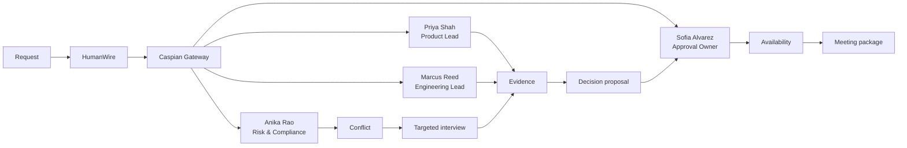

# HumanWire interactive coordination studio design

**Date:** 2026-08-14
**Status:** Approved visual direction; written design awaiting final review
**Supersedes:** the proof viewer as HumanWire's primary local experience
**Preserves:** the existing workflow, repository, gateway, replay, privacy, and authority contracts

## Executive summary

HumanWire will become an interactive coordination product, not a proof dashboard.

The first screen lets a requester describe a real coordination objective in natural language, choose their organizational role, select stakeholders, choose timing, and start a new run. The second screen is a live coordination workspace. It shows HumanWire planning the work, routing messages through the Caspian gateway boundary, receiving distinct stakeholder-agent responses, surfacing agreement and disagreement, conducting a targeted interview when needed, resolving the conflict, collecting approval and availability, and creating the meeting package.

The visible experience must look and read like a finished product. Developer-facing provenance vocabulary such as `synthetic`, `fake`, `proof_class`, `actor_type`, and `local simulation viewer` is prohibited from the primary UI. The product also must not claim that an external provider delivered a message when the external provider has not been configured and verified.

The fastest safe implementation keeps HumanWire's existing deterministic workflow as the authority and adds PydanticAI only as a thin, typed stakeholder-decision adapter. It does not introduce a second workflow engine.

## Product promise

A user can enter:

> Set up a decision meeting tomorrow to approve the launch plan.

HumanWire then:

1. identifies the coordination objective;
2. confirms who is initiating it;
3. selects the minimum necessary stakeholders;
4. chooses an engagement contract for each stakeholder;
5. contacts them through the existing gateway boundary;
6. lets independent stakeholder agents respond from their own role, facts, and constraints;
7. detects disagreement or missing evidence;
8. runs a targeted interview and records the resolution;
9. produces a proposal and gathers final approval;
10. collects availability from required attendees;
11. computes an exact common time; and
12. creates a meeting package only after the saved evidence supports it.

The user watches each persisted step appear in the product as it happens. When the run completes, they can inspect the full workflow, replay it, download JSON or CSV evidence, and start another coordination.

## Experience principles

### Product first

The primary UI uses HumanWire language: coordination, stakeholder, decision, conflict, interview, approval, availability, and meeting. It does not expose internal proof taxonomy.

### Real saved state, not decorative playback

Every visible transition corresponds to a saved event or saved entity. The UI may animate the transition after persistence, but it may not predict or invent a completed step.

### Agents advise; HumanWire governs

Stakeholder agents may decide what to say, whether to agree, and what constraint to raise. They may not forge identity, route a message, change workflow state, approve on behalf of another role, schedule a meeting, or write directly to the database.

### Conflict is part of the product story

The default launch-decision template deliberately includes a realistic disagreement. The conflict must trigger a targeted interview, produce new evidence, and visibly resolve before approval and scheduling.

### Truthful transport presentation

The diagram may show the actual `Caspian Gateway` software boundary because every inbound and outbound action traverses that boundary. The UI may show `Provider connected` only when an external provider connection has passed its separate verification gate. Otherwise a quiet settings/status surface says `Workspace channels` and explains that external channel delivery is not connected. No external-delivery badge is implied by animation alone.

## Approved visual direction

The approved concept has two primary screens that share a deep-navy professional shell, restrained cyan highlights, green completed states, amber attention states, generous type, and responsive card/grid behavior.

### Screen 1: Start a coordination

The composition screen contains:

- HumanWire navigation with `New coordination`, `Decision Room`, `Reach`, and `Data`;
- the heading `Start a coordination`;
- a large natural-language objective field;
- requester-role choices;
- a stakeholder picker with professional names, roles, and avatars;
- a timing choice;
- reusable template cards; and
- a clear `Start coordination` action.

The right side previews the product sequence:

```text
Brief -> Stakeholders -> Resolve -> Approve -> Schedule
```

The first-run default is populated from `Launch decision`, so a user can start immediately without configuring every field.

### Screen 2: Live coordination workspace

The workspace contains:

- the objective and requester context in the header;
- a five-stage lifecycle rail: `Brief`, `Outreach`, `Resolve`, `Approve`, `Schedule`;
- a central live graph;
- a conversation panel with realistic stakeholder messages;
- a saved-data trail explaining what each step generated;
- a current-outcome panel;
- replay controls that operate on this run's saved history; and
- `New coordination` when the run completes.

The graph is the product's visual center:



Only the active saved transition animates. A small pulse travels from the source node to the destination node, the affected stakeholder card highlights, the new message enters the conversation panel, and the generated data point enters the event trail. Reduced-motion mode replaces travel animation with a brief border highlight.

## Professional identity catalog

The initial product catalog uses fictional professional identities:

| Name | Product role | Default engagement |
|---|---|---|
| Maya Chen | Executive sponsor | Inform |
| Nora Jensen | Communications lead | Acknowledge |
| Priya Shah | Product lead | Quick response |
| Marcus Reed | Engineering lead | Quick response |
| Anika Rao | Risk & compliance lead | Structured interview |
| Sofia Alvarez | Approval owner | Review and approval |
| Daniel Brooks | Operations lead | Availability |
| Elena Torres | Business owner | Change authority |

The requester appears as `Alex Morgan` in the default template, with the user-selected role shown beside the name. Internal stable IDs remain independent of presentation names. No private live directory is read or modified by this product catalog.

The primary launch-decision run uses Maya, Nora, Priya, Marcus, Anika, Sofia, and Daniel. Elena is available for templates where a separate business-owner change decision is required; she is not injected into every run merely to satisfy a proof fixture.

## Reusable templates

### Launch decision

- Objective: `Set up a decision meeting tomorrow to approve the launch plan.`
- Requester: Strategy manager
- Participants: the seven primary stakeholders
- Required product behavior: Anika raises a concrete risk constraint, HumanWire conducts a targeted interview, the revised proposal resolves it, Sofia approves, required attendees provide availability, and the meeting package is created.

### Resolve a cross-team conflict

- Objective: `Resolve the launch-readiness disagreement between Product, Engineering, and Risk.`
- Requester: Program lead
- Participants: Priya, Marcus, Anika, and Sofia
- Required product behavior: conflicting positions remain visibly unresolved until new interview evidence supports a proposal.

### Executive decision review

- Objective: `Prepare the minimum evidence needed for an executive go/no-go review.`
- Requester: Executive
- Participants: Maya, Priya, Marcus, Anika, and Sofia
- Required product behavior: HumanWire gathers only missing decision evidence and does not interview everyone.

Templates seed the form. The user may edit the objective, role, participants, and timing before starting.

## Application boundary

The coordination studio is a loopback/private application. It does not make the public Vercel demo writable.

### Run lifecycle

1. The studio starts with no active workflow and displays the composer.
2. `Start coordination` posts a validated request to the loopback server.
3. The server atomically creates a new child run directory and file-backed SQLite database.
4. The server starts one background generation worker for that run.
5. The browser navigates to the live workspace for the returned run alias.
6. The workspace polls an allowlisted snapshot at a short interval and animates only newly persisted steps.
7. Completion enables evidence downloads and `New coordination`.
8. A new request receives a new run root; completed runs are never overwritten.

Only one active run is allowed in the first release. A second start while a run is active returns a safe conflict response and offers to open the current run. This is faster, clearer, and avoids ambiguous shared transport state.

### Why polling, not a second streaming system

The first product version uses 400-600 ms conditional polling with an event ordinal/ETag. Existing progress publication is snapshot-based, polling is resilient to page refreshes, and CSS can animate each new persisted transition smoothly. This avoids adding a second queue or server-sent-event lifecycle under deadline pressure. The API returns `304` or an unchanged ordinal when no data changed.

## Request contract

`CoordinationRequest` is a strict Pydantic model with extra fields forbidden:

- `template_id`: allowlisted optional template;
- `objective`: trimmed, single-purpose text with a bounded length;
- `requester_role`: `manager`, `executive`, `program_lead`, or `team_lead`;
- `requester_name`: fixed catalog alias for the first release;
- `participant_ids`: unique IDs from the local fictional catalog;
- `target_timing`: `tomorrow`, `next_business_day`, or a validated local date;
- `include_conflict`: true for the approved default story; and
- `agent_mode`: `standard` or `model_assisted`.

`standard` uses the existing isolated professional-role policies. `model_assisted` is available only when the server has an explicit model credential and its adapter passes readiness. The product never silently represents standard decisions as model output.

## Agent architecture

### Selected framework: PydanticAI Slim

PydanticAI Slim is the selected open agent layer because it matches the existing Pydantic contracts, supports typed outputs, and can use an OpenAI-compatible model provider without introducing another workflow runtime.

It is used only inside the existing killable decision-process boundary:

```text
Persisted HumanWire delivery
  -> sanitized stakeholder-only context
  -> PydanticAI persona agent constructed in child process
  -> strict PersonaDecision output
  -> parent-side deadline and privacy validation
  -> orchestrator-owned identity and wire translation
  -> one CaspianGateway handler
  -> existing workflow/repository authority
```

Each stakeholder has distinct instructions, role, goals, allowed intents, and bounded private facts. Each receives only their own inbox and transcript. PydanticAI receives no repository, filesystem, browser, shell, route identity, provider destination, credentials, or arbitrary tools.

The current deterministic policies remain the `standard` engine and the complete test/replay fallback. They are not exposed as a fake model. They are visibly described only in the settings surface as `Standard agent reasoning`. `AI-assisted reasoning` is shown only when a live model adapter is configured.

### Why not LangGraph

LangGraph is a strong low-level orchestration runtime for durable execution, streaming, persistence, and human-in-the-loop workflows. HumanWire already implements those responsibilities and has transaction/replay tests around them. Replacing or wrapping that authority now would duplicate state and delay the product.

### Why not CrewAI

CrewAI is designed around crews, flows, delegation, memory, and autonomous multi-agent orchestration. Those abstractions overlap with HumanWire's engagement planner, gateway routing, evidence rules, proposal rounds, approval authority, and meeting state machine. It is therefore a poorer fit for a fast, auditable integration.

## Agent behavior

The initial template yields a coherent, realistic story rather than random chat.

### Priya Shah - Product lead

Priya supports the launch objective but requires the scope and customer impact to remain clear. She returns a concise answer and later accepts a proposal that preserves the launch objective.

### Marcus Reed - Engineering lead

Marcus agrees conditionally. He identifies release-readiness and rollback constraints and refuses wording that implies unverified technical readiness.

### Anika Rao - Risk and compliance lead

Anika initially disagrees because a required risk-control owner is missing. HumanWire opens a targeted interview, asks only the unresolved question, records her answer as asserted evidence, requests exact confirmation, and uses the confirmed constraint in the revised proposal.

### Sofia Alvarez - Approval owner

Sofia reviews only after required evidence is confirmed. She may request one revision; final approval is a typed, authority-bound action rather than inferred sentiment.

### Daniel Brooks - Operations lead

Daniel provides availability and operational constraints only after the decision is approved.

### Maya Chen and Nora Jensen

Maya receives an informative summary. Nora acknowledges communication readiness. Neither is asked unnecessary interview questions.

The workflow may evaluate independent agent decisions concurrently, but results commit in canonical order. Agent prose may vary in model-assisted mode; authority, saved facts, states, and meeting requirements may not.

### Collaboration semantics

Stakeholder agents communicate through HumanWire, not through an unrecorded side channel. HumanWire may send an agent a safe shared proposal or a bounded summary of another stakeholder's confirmed constraint, and that agent may respond to it. An agent never receives another person's private facts, raw transcript, or hidden reasoning. This creates visible multi-agent negotiation while keeping identity, privacy, and decision authority auditable.

The approved launch story should read naturally in the conversation panel, for example:

```text
HumanWire -> Priya Shah
Does the proposed launch scope support a decision tomorrow?

Priya Shah -> HumanWire
Yes, if the customer-impact statement remains in the decision record.

Anika Rao -> HumanWire
I cannot support approval yet. The rollback control has no named owner.

HumanWire -> Anika Rao
Targeted follow-up: which owner and evidence would resolve that risk?

Anika Rao -> HumanWire
Engineering can own the rollback checkpoint if the result is recorded before approval.

HumanWire -> Sofia Alvarez
The revised proposal now includes the confirmed rollback owner and customer-impact statement.

Sofia Alvarez -> HumanWire
Approved. Proceed to availability for the required attendees.
```

The exact prose may differ in model-assisted mode, but the sequence and authority gates remain the same.

## Safe product projection

The proof viewer intentionally exposed only minimal event labels. The product needs a richer but still allowlisted presentation model.

`CoordinationWorkspaceSnapshot` contains:

- run alias, objective, requester name and role, and target timing;
- lifecycle stage and status;
- graph nodes and edges using presentation aliases only;
- stakeholder display name, role, avatar initials, state, and engagement label;
- a conversation timeline containing safe rendered messages;
- a data trail containing saved entity type and safe result summary;
- progress counts and current outcome;
- completion state and final download availability.

Conversation messages may come only from centrally rendered, bounded action fields. The projection omits private facts, raw prompts, chain-of-thought, provider bodies, email addresses, Telegram handles, route/conversation/connection/message/assignment IDs, credentials, database coordinates, filesystem paths, UUIDs, and internal exception text.

The projection is immutable once stored in the run snapshot. A browser cannot post a fabricated response or mutate workflow state.

## Graph and animation semantics

Every projected event maps through one shared replay mapping to:

- `from_node`;
- `to_node`;
- `generated_label`;
- `stage`;
- `affected_persona_id` or origin;
- `effect`: `persisted` or `inert`;
- `timeline_ordinal`; and
- optional `persisted_ordinal`.

On a new ordinal, the client:

1. highlights the source;
2. animates a pulse along the exact SVG path;
3. highlights the destination;
4. inserts the conversation entry if present;
5. inserts the generated data point;
6. advances the lifecycle rail only if persisted state advanced; and
7. announces the transition in an accessible live region.

Inert or rejected attempts may appear in the data trail as `No state change`; they do not animate a successful stage advance.

Playback controls replay saved transitions only. During an active run, `Pause visuals` stops auto-follow but never pauses the authoritative workflow. `Follow live` returns to the newest saved event. After completion, `Play`, `Pause`, `Previous`, and `Next` operate over the same immutable timeline.

## Local studio routes

The loopback app exposes:

- `GET /` - composer or active-run shell;
- `GET /runs/{run_alias}` - workspace shell;
- `GET /api/catalog` - safe templates, roles, and fictional stakeholders;
- `POST /api/runs` - create one validated run;
- `GET /api/runs/{run_alias}` - current safe workspace snapshot;
- `HEAD /api/runs/{run_alias}` - availability check;
- `GET /api/runs/{run_alias}/evidence.json` - final JSON attachment only;
- `GET /api/runs/{run_alias}/events.csv` - final CSV attachment only; and
- `GET /studio-static/*` - local-only product controller assets.

The public HumanWire application continues to return no route for the studio controller or mutation endpoints.

## Loopback mutation security

Because the studio adds a local POST action, it must enforce all of the following:

- bind only to `127.0.0.1`;
- reject non-loopback and ambiguous `Host` values;
- require `Content-Type: application/json`;
- require a per-process action token in `X-HumanWire-Action`;
- require a matching loopback `Origin` when Origin is present;
- enforce a small request-body limit;
- validate every field with strict Pydantic models;
- create run roots atomically and exclusively;
- allow one active worker and one registered gateway handler;
- return fixed safe errors without echoing submitted content; and
- never read ambient private directory or provider configuration unless the operator explicitly selects the corresponding configured mode.

The browser never receives provider credentials or the private model prompt.

## Downloads

JSON and CSV controls remain disabled until the run is complete.

Both routes:

- validate final snapshot/transcript binding;
- return `Content-Disposition: attachment`;
- use a safe run-alias filename;
- include row-for-row timeline ordinals, persisted ordinals, and effect parity;
- prevent spreadsheet-formula execution in CSV;
- contain the objective and presentation aliases only where approved; and
- never navigate the product to raw JSON.

The browser starts a download and remains on the workspace.

## Responsive behavior

### Desktop

The graph occupies the central canvas and the conversation occupies a fixed right rail. The saved-data trail sits below the graph.

### Tablet

The graph remains above a stacked conversation/data region. Agent nodes preserve readable spacing and do not overlap connectors.

### Mobile

The graph becomes a vertical sequence with agent nodes grouped beneath the gateway. `Conversation` and `Data trail` are accessible tabs below the lifecycle rail. No page-level horizontal scrolling is permitted. Meaningful text is at least 14 px and every focusable control is at least 44 by 44 px.

## Error and recovery behavior

- Invalid request: remain on the composer and show a concise field-level correction.
- A run is already active: open the active run instead of starting a second worker.
- Missing model credential in `model_assisted`: do not start; offer `Standard agent reasoning` or settings.
- Agent timeout/invalid output: show `No response received` in the conversation and a safe inert trail entry; never infer approval.
- Gateway/provider failure: show the saved failure/alternate-channel state and continue only through registered routes.
- Browser refresh: reload the full saved snapshot and continue following from the last ordinal.
- Worker crash: show the persisted last state and a recoverable failure status; never animate an unsaved step.
- No exact attendee overlap: remain in scheduling with the conflict visible; do not create a meeting package.
- Completion: freeze final trace and enable replay/downloads/new coordination.

## Testing strategy

Implementation follows test-driven development. Each product slice begins with a failing behavior test.

### Composer tests

- exact template, role, stakeholder, and timing catalog;
- strict request validation and extra-field rejection;
- loopback host, origin, token, content-type, and size matrix;
- atomic one-active-run behavior;
- public app has none of the new POST or local asset routes.

### Agent tests

- PydanticAI adapter produces the strict PersonaDecision schema;
- each persona sees only its role, bounded facts, own inbox, and own transcript;
- no persona can forge sender, route, message identity, or workflow state;
- hard deadline/child-process cleanup remains intact;
- model absence is explicit and standard mode remains fully functional;
- default story includes disagreement, interview, confirmation, revised proposal, approval, availability, and meeting readiness;
- every non-silence response traverses the single CaspianGateway handler.

### Workspace tests

- start action returns a new run and transitions from composer to workspace;
- snapshots contain only allowlisted presentation data;
- each saved event maps to one exact graph transition;
- active path, affected stakeholder, conversation entry, and generated data point remain synchronized;
- no auto-start before the user starts a run;
- Pause visuals, Follow live, Previous, Next, Play, hidden-page pause, and reduced motion work;
- completion enables attachment downloads and New coordination;
- second run uses a distinct root and does not alter the first.

### Visual verification

The approved request-screen and live-workspace concepts are the visual reference. The final implementation is checked in the in-app browser at 1280x720, 600x900, and 390x844 for:

- faithful shell, lifecycle, graph, conversation, and data-trail hierarchy;
- smooth active-path animation;
- zero clipped text, overlap, or page overflow;
- exactly one active source/destination path and affected stakeholder;
- readable messages and data points;
- keyboard focus, live announcements, and minimum target sizes; and
- working JSON/CSV downloads without navigation.

The exact start-to-meeting workflow is captured as the demo/video workflow after it passes browser verification.

## Delivery slices

1. **Composer and local run API** - create a validated fresh run from an approved template.
2. **Request-driven orchestration** - replace hard-coded mandate text and default proof story with one request-scoped run.
3. **PydanticAI persona adapter** - construct typed role agents inside the existing hard-timeout boundary.
4. **Rich safe projection** - expose conversations, graph transitions, lifecycle, and generated data.
5. **Product workspace** - implement the approved graph-centered screen and responsive behavior.
6. **Replay and downloads** - reuse the exact saved timeline and final attachment gates.
7. **End-to-end verification** - start, conflict, interview, resolve, approve, schedule, replay, download, and start again.

Slices may be developed independently only where their files do not overlap. Integration authority remains in one implementation owner to avoid conflicting workflow changes.

## Acceptance criteria

The product is ready for user review only when all of the following are true:

1. Opening the local URL shows `Start a coordination`, not the proof viewer.
2. The launch template is usable immediately and can be edited.
3. The user selects a requester role and starts a new run.
4. The browser navigates to a live workspace for that new run.
5. The central graph visibly tracks Request -> HumanWire -> Caspian Gateway -> stakeholders -> resolution -> approval -> meeting.
6. Professional names and roles appear everywhere; primary UI contains none of the prohibited proof vocabulary.
7. Distinct stakeholder agents produce role-appropriate agreement, constraints, disagreement, and approval behavior.
8. At least one disagreement opens a targeted interview and resolves through saved confirmed evidence.
9. Proposal, approval, availability, and exact meeting overlap are visible and persistently backed.
10. Conversations, graph animation, lifecycle stage, and generated-data trail remain on the same event ordinal.
11. Refresh/replay never calls agents again or changes the saved outcome.
12. JSON and CSV download as attachments and preserve event parity.
13. Completion offers `New coordination`, and a second run receives a new isolated root.
14. External-provider wording appears only after a separate verified connection; the workspace does not overclaim delivery.
15. Public Vercel remains read-only and does not expose the local controller or run-creation API.
16. Focused, HumanWire-wide, full-repository, privacy, lint, JavaScript, and browser gates pass.

## Non-goals for the first product release

- a multi-tenant production control plane;
- arbitrary user-supplied live identities;
- multiple simultaneous active runs;
- unbounded agent tools or autonomous browser/shell access;
- replacing HumanWire's workflow with LangGraph, CrewAI, or another orchestrator;
- claiming live external email or Telegram delivery before the private provider gate passes;
- exposing private prompts, chain-of-thought, or internal proof metadata in the product UI; and
- changing the public Vercel demo into a writable application.

## Final implementation decision

Build the approved two-screen HumanWire product now, using the existing HumanWire workflow as authority and PydanticAI Slim as the bounded model-assisted stakeholder layer. Optimize for a fast, coherent, visually convincing end-to-end story before adding broader configuration or deployment features.
