# HumanWire DecisionOS Product and Architecture Design

**Date:** 2026-08-17
**Status:** Approved product direction
**Product identity:** HumanWire DecisionOS
**Initial playbooks:** Launch Decision and Fundraising Readiness

## Executive decision

HumanWire will evolve from a signed-out coordination demonstration into an
authenticated decision operating system for startup teams. It will preserve the
existing authority gateway, append-only workflow truth, safe product projection,
Firestore run repository, Pub/Sub worker, and Cloud Run deployment. New product
layers will add verified users, organizations, roles, evidence workspaces,
transparent Google ADK specialist councils, human approval, reusable decision
memory, and commercial entitlements.

The product promise is:

> HumanWire turns a messy company objective into a decision you can defend, and
> knows when it must stop for human authority.

HumanWire agents are named by function, not presented as real employees. Real
people sign in, belong to organizations, contribute evidence, and exercise the
authority attached to their role. Model output remains advisory until a
server-side HumanWire policy accepts it.

## Why this direction

The current cloud application proves a real workflow, but it does not yet create
a durable customer account, team boundary, reusable company memory, or recurring
commercial relationship. Adding only a login screen would not solve that. The
approved design uses identity to establish organizational authority and then
connects that authority to documents, agent work, approvals, outcomes, and
billing.

Firebase Authentication supports Google and other identity providers and can
verify identity tokens in a custom backend. Upgrading to Identity Platform adds
MFA, audit logging, SAML/OIDC, multi-tenancy, and enterprise support. The official
capability references are:

- <https://firebase.google.com/docs/auth>
- <https://cloud.google.com/security/products/identity-platform>
- <https://firebase.google.com/docs/app-check>
- <https://firebase.google.com/docs/firestore/query-data/listen>

## Goals

1. Give every product action a verified user, organization, workspace, role, and
   decision context.
2. Preserve HumanWire as the only authority for persistence, approval, scheduling,
   and side effects.
3. Replace opaque generic AI activity with a visible council of bounded specialist
   agents, tools, evidence, challenges, and outputs.
4. Make startup decisions reusable through playbooks, artifacts, and organizational
   memory.
5. Launch a premium Fundraising Readiness playbook without claiming to guarantee
   financing or make an investment decision.
6. Create measurable activation, retention, referral, and revenue loops.
7. Use Google Cloud credits for product differentiation and evaluation, not for
   gratuitous infrastructure.

## Non-goals

- Agents do not impersonate employees, investors, lawyers, accountants, or other
  real people.
- HumanWire does not guarantee fundraising, investor interest, legal compliance,
  financial performance, or decision quality.
- A model cannot authenticate a person, grant membership, change a role, approve a
  decision, choose a delivery destination, or create an external calendar event.
- The first release does not replace the existing public submission demo or its
  deterministic proof path.
- The first release does not build a generic no-code agent marketplace.
- The first release does not allow direct browser writes to authoritative run or
  approval records.

## Customer and user model

### Initial customer

The initial customer is a founder or operating leader at a 2–100 person startup
who must make consequential decisions with incomplete evidence and distributed
stakeholders.

### Roles

| Role | Capabilities |
| --- | --- |
| Owner | Manage organization, billing, retention, members, and all workspaces |
| Admin | Manage members, invitations, workspace settings, and playbooks |
| Decision owner | Create, cancel, revise, and submit decisions for approval |
| Contributor | Add evidence and respond to assigned questions |
| Approver | Review an exact recommendation digest and approve, reject, or request changes |
| Viewer | Read sanitized workspaces and artifacts only |

Organization membership is resolved from authoritative Firestore membership
documents on the server. Firebase custom claims are reserved for rare platform-wide
flags; they are not the source of frequently changing organization roles.

## Product information architecture

### Signed-out surface

- Product narrative and example decision packet
- Interactive credential-free demonstration
- Sign in with Google
- Join by invitation
- Pricing and security pages

### Signed-in application

- **Home:** active decisions, required actions, recent outcomes
- **Decisions:** playbook catalog, drafts, active councils, completed decisions
- **Evidence:** uploaded sources, extraction status, citations, conflicts
- **Team:** members, invitations, roles, approval authority
- **Memory:** prior decisions, assumptions, outcomes, reusable evidence
- **Analytics:** cycle time, blocked stages, evidence coverage, decision outcomes
- **Settings:** organization, security, retention, integrations, billing

Existing labels such as Decision Room, Reach, and Data become views within one
decision rather than appearing to be unrelated top-level products.

## Core user journeys

### Organization onboarding

1. A user signs in with Google through Firebase Authentication.
2. The browser exchanges the Firebase ID token for a Secure, HttpOnly,
   SameSite=Lax server session cookie.
3. The user creates an organization or accepts an invitation.
4. HumanWire records a membership role and an immutable audit event.
5. The user selects a playbook and creates a workspace.

### Launch Decision

1. The decision owner states an objective, timing, participants, and constraints.
2. HumanWire builds a bounded council plan.
3. Specialist agents inspect supplied evidence and return typed candidates.
4. The authority gateway accepts, rejects, or marks each candidate inert.
5. Conflicts and missing evidence become visible tasks.
6. An authenticated approver acts on the exact recommendation digest.
7. HumanWire produces a decision memo, action plan, and meeting package.

### Fundraising Readiness

1. A founder creates a fundraising workspace.
2. The founder uploads a deck, financial model, traction evidence, product material,
   customer evidence, and fundraising assumptions.
3. Document AI and local validators extract structured facts with source locations.
4. Transparent specialists analyze market, finance, product, risk, investor fit,
   and diligence readiness.
5. A red-team specialist challenges unsupported claims and contradictions.
6. HumanWire produces a rubric-based readiness assessment, investment memo,
   evidence matrix, risk register, deck revision recommendations, investor Q&A,
   diligence list, and next-action plan.
7. The founder approves what may be shared. HumanWire does not contact investors
   without a later explicit, consented integration action.

## Architecture

```mermaid
flowchart LR
    User["Founder or team member"] --> Auth["Firebase Auth / Identity Platform"]
    Auth --> Session["Cloud Run session boundary"]
    Session --> Membership["Organization membership + RBAC"]
    Membership --> Workspace["Decision workspace"]
    Uploads["Cloud Storage uploads"] --> Intake["Document AI + local validators"]
    Intake --> Evidence["Cited evidence registry"]
    Workspace --> Council["Google ADK specialist graph"]
    Evidence --> Council
    Council --> Gateway["HumanWire authority gateway"]
    Gateway --> Store["Private authoritative Firestore state"]
    Store --> Projection["Sanitized realtime projection"]
    Projection --> UI["DecisionOS application"]
    Gateway --> Approval["Authenticated human checkpoint"]
    Approval --> Artifacts["Memo, actions, diligence, meeting package"]
    Artifacts --> Memory["Organizational decision memory"]
    Memory --> Analytics["BigQuery product and outcome analytics"]
```



### Deployment topology

The existing public submission service remains available as a stable demo. A new
DecisionOS web service is deployed separately until its authentication, tenancy,
security, and migration gates pass.

- **DecisionOS web:** Cloud Run, public ingress, authenticated application routes.
- **Worker:** Cloud Run, private ingress, Pub/Sub OIDC invocation only.
- **Firestore:** authoritative private collections plus client-readable sanitized
  projections.
- **Cloud Storage:** private organization-scoped uploads and generated artifacts.
- **Document AI:** asynchronous extraction for supported files.
- **Vertex AI / Gemini / ADK:** typed advisory analysis.
- **BigQuery:** append-only product and outcome events that exclude private content.

The Python/Jinja application remains during the first migration phase. A frontend
rewrite is not required to prove the product. Firebase web modules are bundled and
self-hosted with the application so authentication does not depend on an unpinned
runtime CDN import.

## Authentication and session boundary

1. The web client uses Firebase Authentication for Google sign-in and email-link
   recovery. Additional providers are enabled only when product demand exists.
2. The client sends one Firebase ID token to `POST /api/session/login` with an App
   Check token and CSRF-bound request.
3. The backend verifies the ID token with Firebase Admin, creates a bounded Firebase
   session cookie, and returns no token material.
4. Every authenticated request verifies the session cookie, checks revocation for
   sensitive operations, resolves membership, and applies RBAC.
5. Logout revokes the server session and clears the cookie.
6. Authentication errors are fixed safe codes and never log tokens, claims, email
   addresses, provider payloads, or cookies.

## Tenant and data boundaries

### Firestore collections

```text
organizations/{organization_id}
organizations/{organization_id}/members/{uid}
organizations/{organization_id}/invitations/{invitation_id}
organizations/{organization_id}/workspaces/{workspace_id}
organizations/{organization_id}/projections/{run_alias}
organizations/{organization_id}/projections/{run_alias}/timeline/{ordinal}
organizations/{organization_id}/artifacts/{artifact_id}
organizations/{organization_id}/evidence/{evidence_id}

humanwire_private_runs/{run_alias}
humanwire_private_runs/{run_alias}/timeline/{ordinal}
humanwire_private_approvals/{approval_id}
humanwire_audit/{audit_id}
```

The browser may read only sanitized organization projections allowed by Firestore
Security Rules. Direct browser writes are denied. All mutation APIs re-check
membership and role server-side. Service libraries use IAM and bypass Security
Rules, so least-privilege service accounts remain mandatory.

Every private run binds `organization_id`, `workspace_id`, `created_by_uid`,
`playbook_id`, and `policy_version`. An alias alone is never sufficient to load a
run.

### Storage layout

```text
organizations/{organization_id}/workspaces/{workspace_id}/uploads/{upload_id}/source
organizations/{organization_id}/workspaces/{workspace_id}/artifacts/{artifact_id}
```

Uploads use short-lived server-authorized grants, content-type and size allowlists,
malware scanning where available, immutable object identities, and a separate
extraction status record. Filenames are display metadata only and never become
storage paths.

## Authority and approval model

An approval is valid only when all of these values match:

- authenticated Firebase UID
- active organization membership
- required approver role
- organization and workspace identifiers
- decision/run identifier
- recommendation semantic digest
- approval challenge nonce
- active workflow state
- bounded expiry

The approval transaction appends an immutable audit event and advances the workflow
exactly once. Model text, UI state, stale links, or a role name embedded in a token
cannot satisfy approval.

## Specialist council

The current deterministic `GoogleAdkCoordinator` selector is retained as a fallback,
but DecisionOS introduces a real ADK graph. The initial functional specialists are:

- Objective Framing
- Market Intelligence
- Financial Analysis
- Product and Technical Diligence
- Risk and Compliance
- Stakeholder and Authority
- Red Team
- Decision Synthesis

Each specialist has an explicit input schema, output schema, tool allowlist, token
budget, deadline, and evidence requirement. Specialists may read sanitized evidence
through tools and submit typed candidates. They cannot mutate Firestore, approve a
decision, send external messages, or invent citations.

Parallel research nodes feed a synthesis node. A red-team node challenges the first
synthesis. The final candidate goes through the existing HumanWire policy and
gateway. Unsupported statements are rendered as assumptions, not facts.

## Evidence model

Every decision claim is one of:

- `confirmed_fact`
- `source_assertion`
- `model_inference`
- `human_assumption`
- `unresolved_conflict`

Every sourced claim stores an evidence identifier, source digest, bounded location,
extraction version, and confirmation state. UI copy distinguishes observed source
content from model interpretation. Deleted sources invalidate derived artifacts and
require regeneration rather than silently preserving unsupported claims.

## Fundraising readiness outputs

The readiness score is a rubric, not a model-generated number. Initial dimensions:

- problem and urgency
- market evidence
- product differentiation
- traction quality
- business model
- financial coherence
- team and execution risk
- legal and diligence readiness
- fundraising narrative

Each dimension has explicit evidence requirements, score anchors, confidence, and
unresolved questions. HumanWire displays evidence coverage separately from the
score so missing documents cannot appear as a favorable assessment.

## Product experience principles

1. Start with the objective and required human action, not infrastructure labels.
2. Show why each specialist is active and what evidence it is using.
3. Collapse repetitive persistence events into meaningful product milestones.
4. Preserve a detailed audit view for advanced users.
5. Display current state, selected historical state, and final outcome separately.
6. Keep all controls keyboard accessible with at least 44×44 CSS-pixel targets.
7. Never use “live person,” “employee,” “investor,” or equivalent copy for an AI
   specialist.
8. Make missing evidence, disagreement, and blocked authority visually prominent.

## Security and privacy requirements

- Firebase Auth establishes identity; organization membership establishes authority.
- App Check is enforced for mutation endpoints after monitored rollout.
- CSRF protection remains required even with SameSite cookies.
- All cookies are Secure, HttpOnly, scoped, bounded, and excluded from logs.
- Firestore rules deny direct access to private run, approval, and audit collections.
- Every server query includes the authorized organization and workspace boundary.
- Cloud Storage rules deny enumeration and cross-organization paths.
- Private uploaded content is never placed in product analytics, logs, prompts not
  required for the task, screenshots, or public exports.
- Model and tool traces are redacted before entering the product projection.
- Secrets remain in Secret Manager and are never exposed as Firebase configuration.
- Account deletion, organization export, retention, and legal-hold policies are
  explicit before a paid launch.

## Reliability and failure behavior

- Authentication failure leaves public content usable and the private app locked.
- Missing or revoked membership returns a fixed forbidden response.
- Agent failure produces a bounded failed or partial specialist result; completed
  prior evidence remains visible.
- Document extraction failure preserves the original upload and exposes a retryable
  safe status.
- A stale approval digest is rejected without mutation.
- Pub/Sub delivery remains at least once; repository idempotency prevents duplicate
  authoritative transitions.
- Realtime projection loss falls back to bounded polling without exposing private
  collections.

## Observability and evaluation

Operational metrics contain opaque identifiers and counts, not customer content.
Required product metrics include:

- signup completion
- organization creation
- first evidence upload
- first council started
- first decision completed
- time to first value
- invitation acceptance
- weekly active decision owners
- playbook reuse
- approval cycle time
- evidence coverage
- failed/partial council rate
- artifact share rate
- free-to-paid conversion
- retention by playbook

Agent evaluation includes schema validity, citation precision, evidence coverage,
unsupported-claim rate, red-team issue recall, deterministic gateway acceptance,
latency, and cost per completed decision.

## Commercial model

The following are pricing hypotheses to validate, not final promises:

- **Free:** one organization, one active workspace, limited councils.
- **Founder:** approximately $79/month for recurring startup decisions.
- **Team:** approximately $299/month for collaboration, integrations, and analytics.
- **Fundraising Sprint:** approximately $799–$1,499 for a bounded premium workspace.
- **Investor/Diligence:** portfolio and investment-committee workspace pricing.
- **Enterprise:** SSO, audit exports, retention controls, custom policies, and private
  deployment.

Growth loops are invitation of collaborators, advisor/approver participation,
shareable sanitized decision packets, accelerator partnerships, reusable playbooks,
and artifact recipients who can create their own organization.

## Google credit allocation

Credits are allocated by product value:

1. Grounded Gemini analysis and ADK evaluation.
2. Document AI extraction and supported multimodal evidence.
3. Cloud Run, Firestore, Storage, Pub/Sub, and monitoring for real customer trials.
4. BigQuery activation and outcome analytics.
5. Limited media generation only when it improves customer acquisition material.

Credits are not consumed merely to demonstrate that another Google service can be
connected.

## Rollout

The approved implementation is divided into four independently testable plans:

- [Identity and organization foundation](../plans/2026-08-17-humanwire-decisionos-foundation.md)
- [Transparent ADK specialist council](../plans/2026-08-17-humanwire-agent-council.md)
- [Fundraising Readiness playbook](../plans/2026-08-17-humanwire-fundraising-readiness.md)
- [Commercial growth and enterprise controls](../plans/2026-08-17-humanwire-commercial-growth.md)

### Phase 1 — Identity and organizations

Firebase sign-in, server sessions, organizations, invitations, RBAC, tenant-bound
workspaces, and a separate DecisionOS Cloud Run service.

### Phase 2 — Transparent specialist council

Real ADK graph, safe evidence tools, grounded specialist outputs, red-team stage,
evaluation harness, and meaningful live visualization.

### Phase 3 — Fundraising Readiness

Private uploads, Document AI extraction, rubric scoring, investment memo, evidence
matrix, deck revisions, diligence package, and founder approval.

### Phase 4 — Commercial growth

Entitlements, billing, invitations and sharing loops, BigQuery product analytics,
notifications, retention controls, and enterprise identity upgrade.

## Release gates

DecisionOS is not promoted over the existing demo until:

1. Cross-tenant read/write tests fail closed.
2. Session, revocation, CSRF, App Check, invitation, and role-transition tests pass.
3. Public demo frozen behavior and authority digests remain unchanged.
4. Every specialist output has typed validation and evidence classification.
5. Browser acceptance passes at desktop, tablet, and 390×844 mobile.
6. Security Rules emulator tests and service-account IAM checks pass.
7. A full privacy scan finds no credentials, contact data, private source text, or
   internal identifiers in public projections, analytics, logs, or artifacts.
8. Cost, latency, failure, and token-budget dashboards exist before external trials.

## Durable product moat

The defensible asset is not access to Gemini. It is HumanWire's accumulated
decision graph: authority-aware workflows, evidence provenance, organizational
memory, reusable playbooks, measured outcomes, evaluation data, and integrations.
That combination improves product quality while making customer switching less
attractive without trapping customer data.
