# HumanWire AI Company and Organization Onboarding Design

**Date:** 2026-08-18

**Status:** Approved direction; specification review requested

**Extends:** `2026-08-17-humanwire-decisionos-design.md`
**Product identity:** HumanWire DecisionOS

## Executive decision

HumanWire will support a complete operating-company experience rather than an
invite-only collaboration model. An organization owner can import or synchronize
an entire company, review an interactive organization graph, activate selected
people without inviting everyone, add bounded Gemini specialists to capability
gaps, and run decisions through a visible cross-functional council.

Gemini specialists are functional AI roles, never fake employees. Imported people
remain directory records until an authorized administrator explicitly invites or
activates them. The authenticated founder or delegated human approver retains final
authority. HumanWire remains the only component allowed to validate, persist, and
advance authoritative workflow state.

The initial production model is Vertex AI `gemini-3.7-flash`, verified as GA in
the live Google Model Garden on 2026-08-18. Model selection and pricing remain
configuration, not hard-coded authority.

## Product promise

> Bring in the company you already have, add the AI capabilities you are missing,
> and make consequential decisions through a process you can inspect and defend.

## Goals

1. Onboard a whole organization without manually inviting each person.
2. Keep imported directory presence separate from product authentication and
   authority.
3. Convert structured directories and messy organization material into a reviewable
   organization draft.
4. Show organization, team, and cross-organization relationships in an interactive,
   accessible graph.
5. Show decision authority separately from reporting hierarchy.
6. Dynamically assemble the smallest relevant Gemini council for each decision.
7. Preserve human approval, tenant isolation, evidence provenance, and the existing
   HumanWire gateway.
8. Make model and infrastructure cost visible and bounded.

## Non-goals

- Importing a person does not create a Firebase account or grant product access.
- HumanWire does not read email bodies, chats, calendars, or files merely because a
  Microsoft 365 or Google Workspace directory is connected.
- An organization connector does not write to the source directory in the initial
  release.
- Gemini does not impersonate an imported person or speak in that person's name.
- A reporting manager is not automatically an approver.
- No model can invite users, assign authority, activate a directory member, approve
  a recommendation, or expose one organization's private graph to another.
- The first release is not a general HRIS replacement or employee-monitoring tool.

## Core concepts

### Organization subject

An organization subject represents something that can appear in the operating
graph. Identity kind and onboarding lifecycle are separate dimensions.

**Identity kinds**

- `human`: a real person imported or added by an administrator.
- `ai_specialist`: a functional Gemini role with a bounded mandate.
- `external`: an advisor, partner, investor, vendor, or other restricted party.
- `service`: a system integration displayed only where operationally useful.

**Human lifecycle states**

- `draft_imported`: present only in an uncommitted import draft.
- `directory_only`: committed to the organization graph with no sign-in access.
- `invited`: invitation issued but not accepted.
- `active`: authenticated membership is bound to the directory record.
- `suspended`: retained for history but denied access.
- `needs_review`: incomplete, conflicting, or duplicated source information.

An AI specialist never transitions through human invitation states. Its status is
`available`, `assigned`, `working`, `blocked`, or `disabled`.

### Organization graph

The organization graph contains departments, teams, people, AI specialists,
reporting relationships, collaboration relationships, and approved external
boundaries. It does not grant decision authority by itself.

### Authority map

The authority map records who may perform each function for a bounded decision
type:

- accountable decision owner
- evidence contributor
- specialist recommender
- mandatory challenger
- human approver
- execution owner
- informed observer

Authority policies bind organization, workspace, playbook, decision type, role,
subject, effective interval, and policy version. Server-side policy remains
authoritative; visual graph edges are projections only.

## AI operating company

### Persistent specialist catalog

| Specialist | Mandate |
| --- | --- |
| Chief of Staff | Select the relevant council, coordinate dependencies, and expose blockers |
| Product Strategy | Product direction, prioritization, roadmap, and trade-offs |
| Technical Architecture | Feasibility, architecture, security, reliability, and engineering effort |
| Market Intelligence | Market structure, competition, positioning, and opportunity |
| Customer Research | Customer problems, personas, evidence, and unmet needs |
| Growth and Sales | Acquisition, pricing, partnerships, pipeline, and revenue mechanics |
| Finance and Capital | Budget, runway, unit economics, financing, and capital allocation |
| Operations | Execution plan, dependencies, timing, capacity, and ownership |
| Data and Evidence | Claim verification, source coverage, contradictions, and missing proof |
| Legal and Compliance | Regulatory, contractual, privacy, and policy constraints |
| Risk Challenger | Adversarial review, failure scenarios, and unresolved assumptions |
| Investor Relations | Funding narrative, diligence readiness, and investment memo structure |
| People and Organization | Hiring, capacity, incentives, and organizational impact |
| Decision Recorder | Audit timeline, exact decisions, actions, owners, and final package |

The authenticated human founder or delegated approver is displayed separately and
is not modeled as an AI specialist.

### Dynamic council selection

All specialists remain visible in the organization catalog, but a normal decision
activates only the relevant council.

1. The Chief of Staff and Decision Recorder are always included.
2. HumanWire selects three to six domain specialists from the decision type,
   authority map, evidence types, and organization capability gaps.
3. Legal and Compliance is mandatory only for policies that require it.
4. Risk Challenger is mandatory for consequential decisions and optional for
   low-risk operational choices.
5. The default maximum is eight active AI specialists.
6. A full-company review requires an explicit human choice and separate budget
   estimate.
7. The selector emits reasons for inclusion and exclusion; it cannot silently add
   an agent with broader tools or authority.

Examples:

- Fundraising: Finance, Investor Relations, Market, Growth, Evidence, Legal, Risk.
- Product launch: Product, Technical, Customer, Growth, Operations, Risk.
- Hiring: People, Finance, Operations, Legal.
- Partnership: Growth, Legal, Finance, Technical, Risk.
- General strategy: Market, Product, Finance, Customer, Evidence, Risk.

### Decision execution

```mermaid
flowchart LR
    U["Authenticated decision owner"] --> W["Decision workspace"]
    W --> S["Chief of Staff selects council"]
    S --> P["Parallel domain analysis"]
    P --> X["Cross-examination"]
    X --> R["Risk challenge"]
    R --> M["Decision synthesis"]
    M --> G["HumanWire authority gateway"]
    G --> H["Human approval"]
    H --> A["Decision package and organization memory"]
```



Each specialist receives a role-specific input view, source identifiers, typed
output schema, tool allowlist, token ceiling, deadline, and retry limit. It returns
advisory candidates only. Cross-examination can request evidence or a revision but
cannot advance workflow state.

## Model and budget policy

### Model configuration

- Primary specialist model: `gemini-3.7-flash`.
- Medium thinking: Market, Customer, Evidence, Operations, and routine routing.
- High thinking: Risk, Finance for consequential decisions, Legal, and final
  synthesis.
- A cheaper configured model may perform deterministic-like classification only
  after evaluation; it cannot replace a required specialist without disclosure.
- The provider model ID, thinking level, prompt version, token usage, latency, and
  accepted/rejected status are recorded in a private cost/evaluation ledger.

### Cost boundaries

Introductory price evidence captured on 2026-08-18 is $0.75 per million input
tokens and $3.75 per million output/reasoning tokens through 2026-12-31. The
announced 2027 price is $1.50 input and $7.50 output. Prices are versioned
configuration and must be refreshed before display.

- Normal decision target: $0.07-$0.15.
- Default hard decision ceiling: $0.25.
- Full-company review ceiling: separately estimated and human-confirmed.
- Organization import ceiling: $5.00, with a preview before model work begins.
- One retry is allowed only for transport failure or invalid structured output.
- The worker stops before a provider call that would exceed the reserved budget.
- The UI displays estimated, reserved, and final usage without exposing prompts or
  hidden reasoning.

## Organization onboarding

### Entry points

1. **Upload organization**
   - CSV, XLSX, JSON, and bounded PDF organization charts.
   - Required minimum: stable source row, display name, and either a source identity
     or an administrator-confirmed local identity.
   - Optional: email, title, department, team, manager, location, timezone, skills,
     employment status, and decision responsibilities.

2. **Connect Microsoft 365**
   - Read organization, users, groups, group membership, and manager relationships
     through Microsoft Entra ID and Microsoft Graph.
   - Use the least-privileged read permissions that satisfy the chosen import.
   - Require an authorized tenant administrator for application consent.
   - Do not request mail, chat, file, or calendar content permissions.
   - Calendar free/busy is a future, separately consented integration.

3. **Connect Google Workspace**
   - Read the Workspace directory and groups only after separate domain-admin
     consent.
   - Firebase Google sign-in does not imply Workspace directory access.

4. **Create manually**
   - Add a department, team, person, external collaborator, or AI specialist.

5. **Connector interface for later systems**
   - SCIM, HRIS, CRM, and project-management connectors implement the same staged
     import contract; they are not enabled until separately reviewed.

### Staged import pipeline

```mermaid
flowchart LR
    S["File or directory connector"] --> C["Confined source snapshot"]
    C --> N["Deterministic normalization"]
    N --> AI["Gemini organization mapper"]
    AI --> V["Schema and tenant validation"]
    V --> D["Reviewable import draft"]
    D --> P["Organization and authority preview"]
    P --> H["Administrator commit"]
    H --> O["Versioned organization graph"]
    O --> I["Optional bulk invitations"]
```



Gemini maps ambiguous titles, departments, and reporting clues into a typed draft.
It cannot create memberships, invitations, or authority assignments. Deterministic
validation checks duplicates, cycles, missing managers, invalid source identifiers,
cross-tenant references, oversized values, and unsupported role claims.

### Import reconciliation

Every draft displays:

- source records
- normalized records
- new, updated, unchanged, suspended, and rejected subjects
- directory-only, invited, and active humans
- AI specialists
- duplicate identities
- missing or cyclic managers
- leaderless teams
- unassigned people
- unmapped authority responsibilities
- conflicts requiring human review

Commit is disabled while blocking reconciliation errors remain. Nonblocking gaps
are explicit and acknowledged in the immutable import receipt.

### Continuous synchronization

- A connector creates immutable source snapshots and a proposed diff.
- Additions, moves, title changes, and removals are reviewed before authoritative
  graph mutation unless an organization has enabled a narrow auto-accept policy.
- Source removal suspends access and preserves historical decision attribution; it
  never deletes audit history.
- Invitations are never sent as a side effect of synchronization.
- Disconnecting a source revokes future synchronization and preserves an exportable
  local graph until the owner deletes it under retention policy.

## Organization Map experience

### Views

**Organization view** shows reporting hierarchy, departments, teams, humans, AI
specialists, and external parties.

**Team-to-team view** collapses people into functional teams and displays active
decision handoffs, evidence requests, blockers, and execution ownership.

**Organization-to-organization view** places each organization inside a distinct
security boundary and displays only explicitly shared collaboration nodes and
edges.

**Authority view** overlays decision-owner, recommender, challenger, approver, and
execution responsibilities independently of reporting lines.

### Interaction contract

- Search by name, function, department, role, or onboarding state.
- Filter humans, AI specialists, externals, active members, directory-only records,
  needs-review records, and decision participants.
- Collapse departments and switch between hierarchy and collaboration layouts.
- Open a subject panel showing safe profile fields, mandate, manager, team,
  onboarding state, authority assignments, current decisions, and audit history.
- Drag draft subjects between teams and assign managers before import commit.
- Merge duplicates only through an explicit reviewed operation.
- Show source and last synchronization without exposing connector tokens.
- Preserve selected nodes and viewport across safe realtime updates.
- Support keyboard navigation, visible focus, screen-reader names, reduced motion,
  and at least 44 by 44 CSS-pixel interactive targets.
- Provide tabular equivalents for every graph relationship.

### Visual semantics

Identity kind and lifecycle use separate labels rather than color alone. Examples:

- Human / Active
- Human / Directory only
- Human / Needs review
- AI specialist / Working
- External / Restricted

Counts in the reconciliation panel must equal the rendered graph and directory
table. Empty, loading, partial, stale, failed, and disconnected states are explicit.

## Cross-organization collaboration

Cross-organization collaboration occurs inside a dedicated collaboration space,
not by merging tenant graphs.

- Each organization retains its own membership, directory, authority, and private
  decision state.
- An owner or authorized admin creates a scoped collaboration grant.
- The grant names the participating organizations, visible subjects, shared
  decision types, allowed artifacts, approvers, expiry, and revocation policy.
- A partner sees only the shared subgraph and sanitized artifacts.
- Each organization performs its own required human approval.
- Revocation removes future access without rewriting the shared audit history.
- Gemini specialists receive only the evidence and roles authorized for the shared
  decision.

## Data model

Illustrative Firestore layout:

```text
organizations/{organization_id}
organizations/{organization_id}/org_subjects/{subject_id}
organizations/{organization_id}/org_units/{unit_id}
organizations/{organization_id}/org_edges/{edge_id}
organizations/{organization_id}/authority_policies/{policy_id}
organizations/{organization_id}/imports/{import_id}
organizations/{organization_id}/imports/{import_id}/records/{record_id}
organizations/{organization_id}/connectors/{connector_id}
organizations/{organization_id}/invitations/{invitation_id}
organizations/{organization_id}/members/{uid}
organizations/{organization_id}/specialists/{specialist_id}
organizations/{organization_id}/council_runs/{run_id}
organization_collaborations/{collaboration_id}
humanwire_private_connector_receipts/{receipt_id}
humanwire_private_model_usage/{usage_id}
humanwire_audit/{audit_id}
```

Firestore membership remains the source of product access. `org_subjects` may bind
to a member UID but never grants membership. Connector credentials, provider tokens,
raw imported documents, and unredacted model traces are not stored in browser-readable
collections.

## Service interfaces

### Import service

```python
class OrganizationSource(Protocol):
    def snapshot(self, request: SourceSnapshotRequest) -> SourceSnapshot: ...


class OrganizationImportService(Protocol):
    def create_draft(self, snapshot: SourceSnapshot) -> ImportDraft: ...
    def reconcile(self, draft_id: str) -> ImportReconciliation: ...
    def commit(self, request: CommitImportRequest) -> ImportReceipt: ...
```

The source adapter cannot commit. The model mapper cannot commit. Only the import
service may commit after authenticated authorization, exact draft digest validation,
and blocking-error checks.

### Council service

```python
class CouncilPlanner(Protocol):
    def plan(self, request: CouncilPlanRequest) -> CouncilPlan: ...


class SpecialistRunner(Protocol):
    def evaluate(self, assignment: SpecialistAssignment) -> SpecialistCandidate: ...
```

The plan includes specialist IDs, reasons, schemas, evidence grants, tool grants,
deadlines, token limits, and cost reservations. A candidate must traverse the
existing HumanWire validation and gateway path before it becomes visible workflow
truth.

## Security and privacy

- Authenticate humans with Firebase session cookies; authorize through server-side
  organization membership and authority policy.
- Require CSRF and App Check for connector, import, invitation, and authority
  mutations.
- Use tenant-bound encryption/storage paths and server-side tenant filters.
- Store connector credentials in Secret Manager or an equivalently isolated secret
  boundary, never Firestore or the browser.
- Use least-privileged directory read scopes and separate consent for future mail,
  calendar, chat, or file integrations.
- Reject formula cells, executable content, embedded credentials, paths, commands,
  and unsupported external references in uploaded organization files.
- Never send raw employee directories to analytics.
- Minimize model inputs to the fields required for mapping or the selected decision.
- Redact private source values from provider errors, product projections, logs, and
  exception graphs.
- Provide source disconnect, organization export, correction, suspension, retention,
  and deletion workflows.
- Prevent model output from assigning authority, inferring protected attributes, or
  recommending employment actions from sensitive personal data.

## Failure and recovery

- Connector authorization failure leaves existing organization data unchanged.
- Partial source reads create a failed draft and cannot be committed.
- Model timeout preserves deterministic normalization and allows manual mapping.
- Invalid model output becomes inert and cannot change the graph.
- A stale draft digest or changed source snapshot rejects commit.
- Duplicate import requests are idempotent by source snapshot and request key.
- Concurrent imports serialize at organization commit and surface a refreshable
  conflict.
- Invitation failure does not roll back a committed directory import.
- A failed synchronization never suspends subjects merely because they were absent
  from an incomplete snapshot.
- Browser graph failure falls back to the authoritative directory table.

## Observability and evaluation

Content-free operational metrics include:

- import source type
- source, normalized, rejected, and committed record counts
- draft and commit duration
- duplicate, cycle, and missing-manager counts
- invitation requested, delivered, accepted, and failed counts
- directory-to-active conversion
- connector freshness and failure class
- active specialist count
- council latency, schema validity, timeout, retry, and cost
- human approval and revision counts

Evaluation fixtures cover varied company sizes, malformed uploads, cyclical org
charts, duplicate identities, multilingual titles, reorganizations, cross-tenant
attacks, specialist selection, authority conflicts, and model budget exhaustion.

## Rollout

### Phase 1: Organization foundation

- Typed organization graph and authority map.
- CSV, XLSX, and JSON staged import.
- Import preview, reconciliation, commit, and interactive organization map.
- Directory-only records and optional bulk invitations.

### Phase 2: AI operating council

- Specialist catalog and dynamic council planner.
- Gemini 3.7 Flash role runners.
- Cost reservation, live council graph, cross-examination, risk challenge, synthesis,
  and human approval.

### Phase 3: Enterprise directory connectors

- Microsoft Entra ID / Microsoft Graph read-only synchronization.
- Google Workspace read-only synchronization.
- Versioned diffs, disconnect, and recovery.

### Phase 4: Cross-organization collaboration

- Explicit collaboration spaces, shared subgraphs, scoped artifacts, dual approval,
  expiry, and revocation.

## Acceptance gates

1. An administrator can import a mixed-quality organization file, reconcile every
   source row, correct the draft, and commit without sending an invitation.
2. Imported directory records cannot sign in or gain authority until explicitly
   bound to an active membership.
3. Org graph, directory table, reconciliation counts, and source receipt agree.
4. Reporting cycles, duplicate identities, stale drafts, and cross-tenant edges fail
   closed.
5. Microsoft and Google connectors cannot read mail, chat, calendar, or files under
   their initial permission grants.
6. Synchronization removal suspends access without deleting historical attribution.
7. Organization-to-organization views reveal only the authorized shared subgraph.
8. The council selects the correct bounded specialists for each decision fixture and
   explains every inclusion.
9. Every Gemini candidate is typed, budgeted, deadline-bound, and processed through
   the existing HumanWire gateway.
10. No AI specialist can approve, invite, activate, or assign authority.
11. Cost reservation prevents a provider call that would exceed the configured
    decision or import ceiling.
12. Browser acceptance passes at 1680 by 950, 600 by 900, and 390 by 844 with no
    overlap, clipping, stale selection, inaccessible control, or count mismatch.
13. Firebase authentication, tenant isolation, existing deterministic proofs, and
    frozen replay hashes remain unchanged where the new feature is disabled.

## Recommended addition surfaced during design

The Organization Map should include a distinct **Authority Map**. A reporting chart
answers who manages whom; it does not answer who may recommend, challenge, approve,
or execute a specific decision. Treating hierarchy as authority would create a
serious governance defect. The Authority Map is therefore included in this
specification as a required companion view, subject to final specification approval.

Later optional additions include capability-gap recommendations, succession and
capacity scenarios, calendar free/busy, HRIS/SCIM connectors, and privacy-safe
organization health analytics. They remain out of the initial implementation until
separately approved and threat-modeled.
